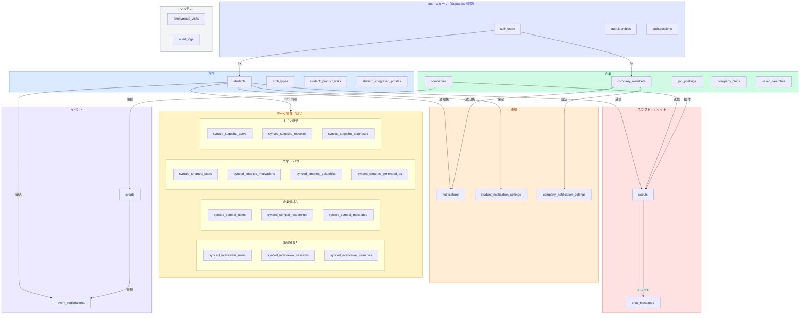

# スカウトサービス データベーススキーマ設計書

## 概要

既存4プロダクト（スマートES / 企業分析AI / 面接練習AI / すごい就活）の学生データを統合し、企業が学生を検索・スカウトできるプラットフォームのデータベース設計。

- **DBMS**: PostgreSQL（Supabase）
- **認証**: Supabase Auth
- **テーブル数**: 31（アプリ固有） + Supabase管理テーブル

---

## スキーマ構成

PostgreSQL の「スキーマ」はデータベース内の名前空間（namespace）。Supabase では以下のスキーマが存在する。

| スキーマ | 管理者 | 用途 |
|---|---|---|
| `public` | アプリ開発者 | アプリのテーブルを配置。RLS を適用 |
| `auth` | Supabase Auth | 認証・セッション管理（Supabase が自動作成・管理する組み込みスキーマ） |
| `storage` | Supabase Storage | ファイルストレージ管理（Supabase が自動作成・管理する組み込みスキーマ） |

**本プロジェクトのテーブルはすべて `public` スキーマに配置する。**

- PostgreSQL のスキーマはネスト（入れ子）できないフラットな構造
- `public` 内のテーブルはプレフィックスで論理グルーピングする（`student_*`, `company_*`, `scout_*`, `synced_*` など）
- MVP の規模ではスキーマ分割は不要。チームや権限が明確に分かれる規模になった場合に検討する

---

## Supabase 管理テーブル（auth / storage スキーマ）

Supabase が自動管理するテーブル。直接 CREATE/ALTER しないが、アプリ側から参照・依存する。

### auth.users — 認証ユーザー（重要）

全ユーザー（学生・企業担当者）の認証情報を管理する Supabase Auth のコアテーブル。`students.id` と `company_members.id` はこのテーブルの `id` を FK として参照する。

| カラム | 型 | 本プロジェクトでの用途 |
|---|---|---|
| id | UUID | PK。students / company_members の id と一致 |
| email | TEXT | ログイン用メールアドレス |
| raw_app_meta_data | JSONB | `role` フィールドにユーザー種別（`student` / `company_owner` / `company_member`）を格納。RLS ポリシーで `auth.jwt()->>'role'` として参照 |
| raw_user_meta_data | JSONB | サインアップ時のメタデータ（氏名等）。LINE連携時は LINE プロフィール情報が自動格納される |
| created_at | TIMESTAMPTZ | アカウント作成日時 |
| updated_at | TIMESTAMPTZ | |
| last_sign_in_at | TIMESTAMPTZ | 最終ログイン日時 |
| banned_until | TIMESTAMPTZ | アカウント停止期限（不正利用対応） |

※ パスワードハッシュ（encrypted_password）等のセキュリティカラムは Supabase Auth が内部管理。アプリ層からは参照しない。

### auth.identities — OAuth プロバイダー紐付け（重要）

LINE連携・マジックリンク等の認証プロバイダー情報。1ユーザーに複数の identity を持てる（LINE + メール等）。

| カラム | 型 | 本プロジェクトでの用途 |
|---|---|---|
| id | TEXT | プロバイダー側のユーザーID |
| user_id | UUID | FK → auth.users(id) |
| provider | TEXT | `line` / `email` 等 |
| identity_data | JSONB | LINE連携時: `sub`（LINE user_id）、`name`、`picture` 等を格納。LINE通知送信時に `identity_data->>'sub'` で LINE user_id を取得 |
| created_at | TIMESTAMPTZ | |
| updated_at | TIMESTAMPTZ | |

※ LINE通知送信時はサーバーサイド（Service Role Key）で `auth.identities` から `provider = 'line'` の `identity_data->>'sub'` を取得して LINE Messaging API に渡す。

### auth.sessions — セッション管理

アクティブセッションを管理。セキュリティ要件書 1.2 のセッション設定（タイムボックス7日、非アクティブ24時間）に従う。

### auth.mfa_factors / auth.mfa_challenges — MFA 管理

企業 owner に必須の TOTP MFA の登録・認証チャレンジ情報。

### auth.flow_state — 認証フロー状態

マジックリンク・OAuth 等の認証フロー中間状態を保持。

### storage.objects / storage.buckets — ファイルストレージ

| バケット | 用途 | アクセス |
|---|---|---|
| `avatars` | 学生のプロフィール画像 | Private + 署名付きURL |
| `company-logos` | 企業ロゴ画像 | Public（審査済み企業のみアップロード可） |

※ バケット設計は開発時に確定。RLS でアップロード権限を制御。

---

## ER図（概要）

テーブルを機能グループごとに色分けして表示。リレーションの詳細は「ER図（詳細）」を参照。



## ER図（詳細）

```mermaid
erDiagram
    %% ===== 認証・プロフィール =====
    students {
        uuid id PK "auth.users(id)"
        text email
        text last_name
        text first_name
        text last_name_kana
        text first_name_kana
        text phone
        date birthdate
        text gender
        text university
        text faculty
        text department
        academic_type academic_type
        int graduation_year
        text prefecture
        text postal_code
        text city
        text street
        text profile_image_url
        text bio
        uuid mbti_type_id FK
        boolean is_profile_public
        timestamptz data_consent_granted_at
        timestamptz deleted_at
        timestamptz created_at
        timestamptz updated_at
    }

    mbti_types {
        uuid id PK
        text type_code "UNIQUE"
        text name_ja
        text name_en
        timestamptz created_at
    }

    companies {
        uuid id PK
        text name
        text industry
        text employee_count_range
        text website_url
        text logo_url
        text description
        text prefecture
        text postal_code
        text city
        text street
        text phone
        boolean is_verified
        timestamptz verified_at
        timestamptz deleted_at
        timestamptz created_at
        timestamptz updated_at
    }

    company_members {
        uuid id PK "auth.users(id)"
        uuid company_id FK
        text email
        text last_name
        text first_name
        company_member_role role "owner / member"
        boolean is_active
        timestamptz created_at
        timestamptz updated_at
    }

    %% ===== データ連携 =====
    student_product_links {
        uuid id PK
        uuid student_id FK
        product_source product
        text external_user_id
        timestamptz linked_at
    }

    %% --- 面接練習AI（interviewai） ---
    synced_interviewai_users {
        uuid id PK
        text external_user_id "面接AI側のuser_id"
        text email "突合用"
        timestamptz original_created_at
        timestamptz synced_at
    }

    synced_interviewai_sessions {
        uuid id PK
        text external_user_id "面接AI側のuser_id"
        text external_session_id
        text company_name "companies.name JOIN"
        text session_type "interview_type.type"
        text industry "interview_type.industry"
        text phase "interview_type.phase"
        text status
        int overall_score "evaluation_data.overallScore"
        jsonb skill_scores "カテゴリ別スコア"
        jsonb strengths "強み"
        jsonb areas_for_improvement "改善点"
        text growth_hint "成長アドバイス"
        jsonb conversation_text "会話トランスクリプト"
        timestamptz started_at
        timestamptz original_created_at
        timestamptz synced_at
    }

    synced_interviewai_searches {
        uuid id PK
        text external_user_id "面接AI側のuser_id"
        text external_search_id
        text company_name "companies.name JOIN"
        timestamptz searched_at
        timestamptz synced_at
    }

    %% --- 企業分析AI（compai） ---
    synced_compai_users {
        uuid id PK
        text external_user_id "企業分析AI側のuser_id"
        text email "突合用"
        timestamptz original_created_at
        timestamptz synced_at
    }

    synced_compai_researches {
        uuid id PK
        text external_user_id "企業分析AI側のuser_id"
        text external_research_id
        text title "企業名・トピック"
        text url "調査対象URL"
        text content "AI分析結果"
        text raw_content "元の生データ"
        jsonb citations "引用元リスト"
        boolean is_bookmarked
        text status
        timestamptz original_created_at
        timestamptz synced_at
    }

    synced_compai_messages {
        uuid id PK
        text external_user_id "企業分析AI側のuser_id"
        text external_message_id
        text external_research_id "紐付くresearch_id"
        text content "メッセージ内容"
        text sender_type "user/assistant"
        timestamptz original_created_at
        timestamptz synced_at
    }

    %% --- スマートES（smartes） ---
    synced_smartes_users {
        uuid id PK
        text external_user_id "スマートES側のuser_id"
        text email "突合用"
        timestamptz original_created_at
        timestamptz synced_at
    }

    synced_smartes_motivations {
        uuid id PK
        text external_user_id "スマートES側のuser_id"
        text external_motivation_id "applicant_motivation_id"
        jsonb generated_params "生成パラメーター"
        text generated_text "志望動機本文"
        int regenerated_count "再生成回数"
        timestamptz generated_at
        timestamptz original_created_at
        timestamptz synced_at
    }

    synced_smartes_gakuchika {
        uuid id PK
        text external_user_id "スマートES側のuser_id"
        text external_gakuchika_id "gakuchika_id"
        jsonb generated_params "生成パラメーター"
        jsonb original_gakuchika_list "生成元一覧"
        text generated_text "ガクチカ本文"
        int regenerated_count "再生成回数"
        timestamptz generated_at
        timestamptz original_created_at
        timestamptz synced_at
    }

    synced_smartes_generated_es {
        uuid id PK
        text external_user_id "スマートES側のuser_id"
        text external_es_id "es_id"
        jsonb generated_params "生成パラメーター"
        jsonb original_es_list "生成元ES一覧"
        text generated_text "生成ES本文"
        int regenerated_count "再生成回数"
        timestamptz generated_at
        timestamptz original_created_at
        timestamptz synced_at
    }

    %% --- すごい就活（sugoshu） ---
    synced_sugoshu_users {
        uuid id PK
        text external_user_id "すごい就活側のuser_id"
        text email "突合用"
        timestamptz original_created_at
        timestamptz synced_at
    }

    synced_sugoshu_resumes {
        uuid id PK
        text external_user_id "すごい就活側のuser_id"
        text external_resume_id
        text content "履歴書内容"
        timestamptz original_created_at
        timestamptz synced_at
    }

    synced_sugoshu_diagnoses {
        uuid id PK
        text external_user_id "すごい就活側のuser_id"
        text external_diagnosis_id
        jsonb diagnosis_data "診断結果"
        timestamptz original_created_at
        timestamptz synced_at
    }

    %% ===== コア機能 =====
    student_integrated_profiles {
        uuid id PK
        uuid student_id FK "UNIQUE"
        text summary "AIによる人物要約"
        jsonb strengths
        jsonb interests
        jsonb skills
        jsonb preferred_work_locations
        activity_level activity_level
        timestamptz generated_at
        text model_version
    }

    scouts {
        uuid id PK
        uuid company_id FK
        uuid sender_id FK
        uuid student_id FK
        text subject
        text message
        uuid job_posting_id FK "NOT NULL"
        scout_status status
        timestamptz sent_at
        timestamptz read_at
        timestamptz responded_at
        timestamptz expires_at
    }

    %% ===== 求人 =====
    job_postings {
        uuid id PK
        uuid company_id FK
        uuid created_by FK
        text title
        text description
        text job_category
        text work_location
        text employment_type
        text salary_range
        text requirements
        text benefits
        int target_graduation_year
        boolean is_published
        timestamptz published_at
        timestamptz deleted_at
        timestamptz created_at
        timestamptz updated_at
    }

    %% ===== チャット =====
    chat_messages {
        uuid id PK
        uuid scout_id FK
        uuid sender_id "auth.users(id)"
        chat_sender_role sender_role
        text content
        timestamptz read_at
        timestamptz created_at
    }

    %% ===== 通知 =====
    notifications {
        uuid id PK
        uuid user_id "auth.users(id)"
        notification_type type
        text title
        text body
        text reference_type
        uuid reference_id
        boolean is_read
        timestamptz read_at
        timestamptz line_sent_at
        timestamptz created_at
    }

    student_notification_settings {
        uuid id PK
        uuid student_id FK "UNIQUE"
        boolean scout_received
        boolean chat_message
        boolean event_reminder
        boolean system_announcement
        boolean line_enabled
        boolean in_app_enabled
        timestamptz updated_at
    }

    company_notification_settings {
        uuid id PK
        uuid company_member_id FK "UNIQUE"
        boolean scout_accepted
        boolean scout_declined
        boolean chat_message
        boolean system_announcement
        boolean line_enabled
        boolean in_app_enabled
        timestamptz updated_at
    }

    %% ===== イベント =====
    events {
        uuid id PK
        uuid company_id FK "NULLable"
        uuid created_by FK "NULLable"
        event_organizer_type organizer_type
        text title
        text description
        text event_type
        event_format format
        text location
        text online_url
        timestamptz starts_at
        timestamptz ends_at
        int capacity
        timestamptz application_deadline
        int target_graduation_year
        boolean is_published
        timestamptz published_at
        timestamptz deleted_at
        timestamptz created_at
        timestamptz updated_at
    }

    event_registrations {
        uuid id PK
        uuid event_id FK
        uuid student_id FK
        event_registration_status status
        timestamptz applied_at
        timestamptz cancelled_at
        timestamptz created_at
    }

    %% ===== トラッキング =====
    anonymous_visits {
        uuid id PK
        text session_token "UNIQUE"
        text utm_source
        text utm_medium
        text utm_campaign
        text utm_term
        text utm_content
        text referrer
        text landing_page
        text user_agent
        text ip_address
        uuid user_id
        timestamptz linked_at
        timestamptz expires_at
        timestamptz created_at
    }

    %% ===== 監査 =====
    audit_logs {
        uuid id PK
        uuid actor_id
        text actor_role
        text action
        text target_type
        uuid target_id
        jsonb details
        text ip_address
        timestamptz created_at
    }

    %% ===== MVP後 =====
    saved_searches {
        uuid id PK
        uuid company_member_id FK
        text name
        jsonb filters
        timestamptz created_at
        timestamptz updated_at
    }

    company_plans {
        uuid id PK
        uuid company_id FK "UNIQUE"
        text plan_type "free / basic / premium"
        text stripe_customer_id
        text stripe_subscription_id
        int scout_quota
        int scouts_sent_this_month
        timestamptz current_period_start
        timestamptz current_period_end
        timestamptz created_at
        timestamptz updated_at
    }

    %% ===== リレーション =====
    mbti_types ||--o{ students : "mbti_type_id"
    students ||--o{ student_product_links : "links"
    student_product_links ||--o| synced_interviewai_users : "external_user_id"
    student_product_links ||--o{ synced_interviewai_sessions : "external_user_id"
    student_product_links ||--o{ synced_interviewai_searches : "external_user_id"
    student_product_links ||--o| synced_compai_users : "external_user_id"
    student_product_links ||--o{ synced_compai_researches : "external_user_id"
    student_product_links ||--o{ synced_compai_messages : "external_user_id"
    student_product_links ||--o| synced_smartes_users : "external_user_id"
    student_product_links ||--o{ synced_smartes_motivations : "external_user_id"
    student_product_links ||--o{ synced_smartes_gakuchika : "external_user_id"
    student_product_links ||--o{ synced_smartes_generated_es : "external_user_id"
    student_product_links ||--o| synced_sugoshu_users : "external_user_id"
    student_product_links ||--o{ synced_sugoshu_resumes : "external_user_id"
    student_product_links ||--o{ synced_sugoshu_diagnoses : "external_user_id"
    students ||--o| student_integrated_profiles : "has"

    students ||--o{ scouts : "receives"
    students ||--o| student_notification_settings : "configures"
    students ||--o{ notifications : "receives"
    students ||--o{ event_registrations : "registers"

    companies ||--o{ company_members : "has"
    companies ||--o{ scouts : "sends"
    companies ||--o| company_plans : "subscribes"
    companies ||--o{ job_postings : "has"
    companies ||--o{ events : "hosts"

    company_members ||--o{ scouts : "sends"
    company_members ||--o{ saved_searches : "saves"
    company_members ||--o{ job_postings : "creates"
    company_members ||--o| company_notification_settings : "configures"
    company_members ||--o{ notifications : "receives"
    company_members ||--o{ events : "creates"

    job_postings ||--o{ scouts : "referenced_by"
    scouts ||--o{ chat_messages : "has_thread"
    events ||--o{ event_registrations : "has"
```



---

## Enum型

| Enum | 値 | 説明 |
|---|---|---|
| `user_role` | `student`, `company_owner`, `company_member` | ユーザー種別（auth.users の raw_app_meta_data.role に格納） |
| `company_member_role` | `owner`, `member` | 企業内ロール（company_members.role に格納） |
| `product_source` | `interviewai`, `compai`, `smartes`, `sugoshu` | 連携元プロダクト。`synced_*` テーブル prefix・ETL Route Handler パスと一致させる |
| `scout_status` | `sent`, `read`, `accepted`, `declined`, `expired` | スカウトの状態遷移 |
| `academic_type` | `liberal_arts`, `science`, `other` | 文理区分 |
| `chat_sender_role` | `student`, `company_member` | チャットメッセージの送信者ロール |
| `notification_type` | `scout_received`, `scout_accepted`, `scout_declined`, `chat_new_message`, `event_reminder`, `system_announcement` | 通知種別 |
| `event_organizer_type` | `company`, `platform` | イベント主催者種別 |
| `event_format` | `online`, `offline`, `hybrid` | イベント開催形式 |
| `event_registration_status` | `applied`, `confirmed`, `cancelled`, `attended` | イベント参加ステータス |
| `activity_level` | `low`, `medium`, `high`, `very_high` | 就活活動量（student_integrated_profiles.activity_level に格納） |

---

## テーブル詳細

### mbti_types — MBTIマスターデータ

16種類のMBTI性格タイプのマスターテーブル。`students.mbti_type_id` から参照される。

| カラム | 型 | 制約 | 説明 |
|---|---|---|---|
| id | UUID | PK, DEFAULT gen_random_uuid() | |
| type_code | TEXT | NOT NULL, UNIQUE | MBTIタイプコード（例: 'INTJ', 'ENFP'） |
| name_ja | TEXT | NOT NULL | 日本語名（例: '建築家'） |
| name_en | TEXT | NOT NULL | 英語名（例: 'Architect'） |
| created_at | TIMESTAMPTZ | DEFAULT now() | |

初期データとして16タイプ（INTJ, INTP, ENTJ, ENTP, INFJ, INFP, ENFJ, ENFP, ISTJ, ISFJ, ESTJ, ESFJ, ISTP, ISFP, ESTP, ESFP）を投入する。

### 1. students — 学生統合プロフィール

学生の基本情報を一元管理する。`id` は Supabase Auth の `auth.users(id)` と一致。

| カラム | 型 | 制約 | 説明 |
|---|---|---|---|
| id | UUID | PK, FK → auth.users(id) | |
| email | TEXT | NOT NULL, UNIQUE | |
| last_name | TEXT | | 姓 |
| first_name | TEXT | | 名 |
| last_name_kana | TEXT | | 姓カナ |
| first_name_kana | TEXT | | 名カナ |
| phone | TEXT | | 電話番号 |
| birthdate | DATE | | 生年月日 |
| gender | TEXT | | 性別 |
| university | TEXT | | 大学名 |
| faculty | TEXT | | 学部 |
| department | TEXT | | 学科 |
| academic_type | academic_type | | 文理区分 |
| graduation_year | INT | | 卒業年度 |
| prefecture | TEXT | | 都道府県 |
| postal_code | TEXT | | 郵便番号 |
| city | TEXT | | 市区町村 |
| street | TEXT | | 番地以降 |
| profile_image_url | TEXT | | プロフィール画像 |
| bio | TEXT | | 自己紹介文 |
| is_profile_public | BOOLEAN | DEFAULT false | 企業への公開フラグ |
| mbti_type_id | UUID | FK → mbti_types(id) | MBTI診断タイプ |
| data_consent_granted_at | TIMESTAMPTZ | | データ連携同意日時 |
| deleted_at | TIMESTAMPTZ | | 論理削除日時（30日後に物理削除） |
| created_at | TIMESTAMPTZ | DEFAULT now() | |
| updated_at | TIMESTAMPTZ | DEFAULT now() | |

### 2. companies — 企業プロフィール

| カラム | 型 | 制約 | 説明 |
|---|---|---|---|
| id | UUID | PK, DEFAULT gen_random_uuid() | |
| name | TEXT | NOT NULL | 企業名 |
| industry | TEXT | | 業界 |
| employee_count_range | TEXT | | 従業員規模（例: "101-500"） |
| website_url | TEXT | | コーポレートサイト |
| logo_url | TEXT | | ロゴ画像 |
| description | TEXT | | 企業説明 |
| prefecture | TEXT | | 都道府県 |
| postal_code | TEXT | | 郵便番号 |
| city | TEXT | | 市区町村 |
| street | TEXT | | 番地以降 |
| phone | TEXT | | 代表電話番号 |
| is_verified | BOOLEAN | DEFAULT false | 運営による審査完了フラグ |
| verified_at | TIMESTAMPTZ | | 審査完了日時 |
| deleted_at | TIMESTAMPTZ | | 論理削除日時（30日後に物理削除） |
| created_at | TIMESTAMPTZ | DEFAULT now() | |
| updated_at | TIMESTAMPTZ | DEFAULT now() | |

### 3. company_members — 企業担当者

企業に所属するリクルーター。`id` は Supabase Auth の `auth.users(id)` と一致。

| カラム | 型 | 制約 | 説明 |
|---|---|---|---|
| id | UUID | PK, FK → auth.users(id) | |
| company_id | UUID | NOT NULL, FK → companies(id) | 所属企業 |
| email | TEXT | NOT NULL | |
| last_name | TEXT | | 姓 |
| first_name | TEXT | | 名 |
| role | company_member_role | DEFAULT 'member' | `owner` / `member` |
| is_active | BOOLEAN | DEFAULT true | アカウント有効フラグ |
| created_at | TIMESTAMPTZ | DEFAULT now() | |
| updated_at | TIMESTAMPTZ | DEFAULT now() | |

### 4. student_product_links — プロダクト紐付け

学生アカウントと既存4プロダクトのアカウントを紐付ける。メールアドレスで自動マッチング後、学生の確認を経て作成。

| カラム | 型 | 制約 | 説明 |
|---|---|---|---|
| id | UUID | PK, DEFAULT gen_random_uuid() | |
| student_id | UUID | NOT NULL, FK → students(id) | |
| product | product_source | NOT NULL | 連携元プロダクト |
| external_user_id | TEXT | NOT NULL | プロダクト側のuser_id |
| linked_at | TIMESTAMPTZ | DEFAULT now() | 紐付け日時 |
| | | UNIQUE(student_id, product) | 1プロダクト1リンク |

### 面接練習AI（interviewai）

命名規則: `synced_interviewai_{元テーブル名}`。元テーブル: `users` + `user_profiles`, `interview_sessions` + `companies`, `user_company_searches` + `companies`

#### 🔵 5. synced_interviewai_users — ユーザー情報

| カラム | 型 | 制約 | 説明 |
|---|---|---|---|
| id | UUID | PK, DEFAULT gen_random_uuid() | |
| external_user_id | TEXT | NOT NULL, UNIQUE | 面接AI側の user_id |
| email | TEXT | NOT NULL | メールアドレス（突合用） |
| original_created_at | TIMESTAMPTZ | | 元データの作成日時 |
| synced_at | TIMESTAMPTZ | DEFAULT now() | 同期日時 |

#### 🔵 6. synced_interviewai_sessions — 面接練習データ

元テーブル `interview_sessions` と `companies` をJOINして取得。

| カラム | 型 | 制約 | 説明 |
|---|---|---|---|
| id | UUID | PK, DEFAULT gen_random_uuid() | |
| external_user_id | TEXT | NOT NULL | 面接AI側の user_id |
| external_session_id | TEXT | NOT NULL | 元テーブルの `id` |
| company_name | TEXT | | 企業名（companies.name JOIN） |
| session_type | TEXT | | 面接タイプ（interview_type.type: 個人/集団/GD等） |
| industry | TEXT | | 志望業界（interview_type.industry） |
| phase | TEXT | | 就活フェーズ（interview_type.phase） |
| status | TEXT | | セッション状態（完了/中断等） |
| overall_score | INT | | 総合スコア（evaluation_data.overallScore） |
| skill_scores | JSONB | | カテゴリ別スコア（logicalStructure, qaSkill, responseContent） |
| strengths | JSONB | | 強み（evaluation_data.strengths） |
| areas_for_improvement | JSONB | | 改善点（evaluation_data.areasForImprovement） |
| growth_hint | TEXT | | 成長アドバイス（evaluation_data.growthHint） |
| conversation_text | JSONB | | 会話トランスクリプト（conversation_text） |
| started_at | TIMESTAMPTZ | | セッション開始日時 |
| original_created_at | TIMESTAMPTZ | | 元データの created_at |
| synced_at | TIMESTAMPTZ | DEFAULT now() | 同期日時 |

#### 🔵 7. synced_interviewai_searches — 企業検索履歴

元テーブル `user_company_searches` と `companies` をJOINして取得。

| カラム | 型 | 制約 | 説明 |
|---|---|---|---|
| id | UUID | PK, DEFAULT gen_random_uuid() | |
| external_user_id | TEXT | NOT NULL | 面接AI側の user_id |
| external_search_id | TEXT | NOT NULL | 元テーブルの `id` |
| company_name | TEXT | | 検索した企業名（companies.name JOIN） |
| searched_at | TIMESTAMPTZ | | 検索日時 |
| synced_at | TIMESTAMPTZ | DEFAULT now() | 同期日時 |

### 企業分析AI（compai）

命名規則: `synced_compai_{元テーブル名}`。元テーブル: `profiles`, `researches`, `research_messages`

#### 🔵 8. synced_compai_users — ユーザー情報

| カラム | 型 | 制約 | 説明 |
|---|---|---|---|
| id | UUID | PK, DEFAULT gen_random_uuid() | |
| external_user_id | TEXT | NOT NULL, UNIQUE | 企業分析AI側の user_id |
| email | TEXT | NOT NULL | メールアドレス（突合用） |
| original_created_at | TIMESTAMPTZ | | 元データの作成日時 |
| synced_at | TIMESTAMPTZ | DEFAULT now() | 同期日時 |

#### 🔵 9. synced_compai_researches — 企業分析レポート

| カラム | 型 | 制約 | 説明 |
|---|---|---|---|
| id | UUID | PK, DEFAULT gen_random_uuid() | |
| external_user_id | TEXT | NOT NULL | 企業分析AI側の user_id（researches.user_id） |
| external_research_id | TEXT | NOT NULL | 元テーブルの `id` |
| title | TEXT | | 調査対象（企業名・トピック） |
| url | TEXT | | 調査対象URL |
| content | TEXT | | AI生成の分析結果 |
| raw_content | TEXT | | 元の生データ |
| citations | JSONB | | 引用元リスト |
| is_bookmarked | BOOLEAN | | ブックマーク済みフラグ |
| status | TEXT | | ステータス（完了/処理中等） |
| original_created_at | TIMESTAMPTZ | | 元データの created_at |
| synced_at | TIMESTAMPTZ | DEFAULT now() | 同期日時 |

**取得しないフィールド:** `perplexity_id`, `model`, `tokens_used`, `plan_tier`（システム内部情報）、`deleted_at`（論理削除済みはETLで除外）

#### 🔵 10. synced_compai_messages — 質問内容

| カラム | 型 | 制約 | 説明 |
|---|---|---|---|
| id | UUID | PK, DEFAULT gen_random_uuid() | |
| external_user_id | TEXT | NOT NULL | 企業分析AI側の user_id（researches経由で取得） |
| external_message_id | TEXT | NOT NULL | 元テーブルの `id` |
| external_research_id | TEXT | NOT NULL | 紐付くresearchのID（research_messages.research_id） |
| content | TEXT | | メッセージ内容 |
| sender_type | TEXT | | user / assistant |
| original_created_at | TIMESTAMPTZ | | 元データの created_at |
| synced_at | TIMESTAMPTZ | DEFAULT now() | 同期日時 |

**取得しないフィールド:** `model`, `tokens_used`（システム内部情報）、`feedback`（UI用フィードバック）

### スマートES（smartes）

命名規則: `synced_smartes_{元テーブル名}`。プロフィール系の細かいテーブルはETL側でJOINして集約。

#### 🔵 11. synced_smartes_users — ユーザー情報

元テーブル: `user`。ETLで `email IS NULL` のレコードは除外する（LINE認証のみでメール未登録のユーザーは突合不可のため）。

| カラム | 型 | 制約 | 説明 |
|---|---|---|---|
| id | UUID | PK, DEFAULT gen_random_uuid() | |
| external_user_id | TEXT | NOT NULL, UNIQUE | スマートES側の user_id |
| email | TEXT | NOT NULL | メールアドレス（突合用） |
| original_created_at | TIMESTAMPTZ | | 元データの created_at |
| synced_at | TIMESTAMPTZ | DEFAULT now() | 同期日時 |

#### 🔵 12. synced_smartes_motivations — 志望動機

元テーブル: `users_generated_applicant_motivations`

| カラム | 型 | 制約 | 説明 |
|---|---|---|---|
| id | UUID | PK, DEFAULT gen_random_uuid() | |
| external_user_id | TEXT | NOT NULL | スマートES側の user_id |
| external_motivation_id | TEXT | NOT NULL, UNIQUE | 元テーブルの `applicant_motivation_id` |
| generated_params | JSONB | | 生成時のパラメーター（企業名等を含む） |
| generated_text | TEXT | | 生成された志望動機の本文 |
| regenerated_count | INT | | 再生成回数（推敲の深さ） |
| generated_at | TIMESTAMPTZ | | 生成日時 |
| original_created_at | TIMESTAMPTZ | | 元データの created_at |
| synced_at | TIMESTAMPTZ | DEFAULT now() | 同期日時 |

#### 🔵 13. synced_smartes_gakuchika — ガクチカ

元テーブル: `users_generated_gakuchika`

| カラム | 型 | 制約 | 説明 |
|---|---|---|---|
| id | UUID | PK, DEFAULT gen_random_uuid() | |
| external_user_id | TEXT | NOT NULL | スマートES側の user_id |
| external_gakuchika_id | TEXT | NOT NULL, UNIQUE | 元テーブルの `gakuchika_id` |
| generated_params | JSONB | | 生成時のパラメーター |
| original_gakuchika_list | JSONB | | 生成元となったガクチカの参照一覧 |
| generated_text | TEXT | | 生成されたガクチカの本文 |
| regenerated_count | INT | | 再生成回数（推敲の深さ） |
| generated_at | TIMESTAMPTZ | | 生成日時 |
| original_created_at | TIMESTAMPTZ | | 元データの created_at |
| synced_at | TIMESTAMPTZ | DEFAULT now() | 同期日時 |

#### 🔵 14. synced_smartes_generated_es — AI生成ES

元テーブル: `users_generated_es`

| カラム | 型 | 制約 | 説明 |
|---|---|---|---|
| id | UUID | PK, DEFAULT gen_random_uuid() | |
| external_user_id | TEXT | NOT NULL | スマートES側の user_id |
| external_es_id | TEXT | NOT NULL, UNIQUE | 元テーブルの `es_id` |
| generated_params | JSONB | | 生成時のパラメーター（企業名・設問等を含む） |
| original_es_list | JSONB | | 生成元となったESの参照一覧 |
| generated_text | TEXT | | 生成されたESの本文 |
| regenerated_count | INT | | 再生成回数（推敲の深さ） |
| generated_at | TIMESTAMPTZ | | 生成日時 |
| original_created_at | TIMESTAMPTZ | | 元データの created_at |
| synced_at | TIMESTAMPTZ | DEFAULT now() | 同期日時 |

### すごい就活（sugoshu）

命名規則: `synced_sugoshu_{元テーブル名}`。元テーブル: `user` + `user_profile`, `resumeDraft`, 診断テーブル

#### 🔵 15. synced_sugoshu_users — ユーザー情報

元テーブル `user` と `user_profile` をJOINして取得。

| カラム | 型 | 制約 | 説明 |
|---|---|---|---|
| id | UUID | PK, DEFAULT gen_random_uuid() | |
| external_user_id | TEXT | NOT NULL, UNIQUE | すごい就活側の user_id |
| email | TEXT | NOT NULL | メールアドレス（突合用） |
| original_created_at | TIMESTAMPTZ | | 元データの作成日時 |
| synced_at | TIMESTAMPTZ | DEFAULT now() | 同期日時 |

#### 🔵 16. synced_sugoshu_resumes — 履歴書

元テーブル: `resumeDraft`

| カラム | 型 | 制約 | 説明 |
|---|---|---|---|
| id | UUID | PK, DEFAULT gen_random_uuid() | |
| external_user_id | TEXT | NOT NULL | すごい就活側の user_id |
| external_resume_id | TEXT | | すごい就活側の resume_id |
| content | TEXT | | 履歴書内容 |
| original_created_at | TIMESTAMPTZ | | 元データの作成日時 |
| synced_at | TIMESTAMPTZ | DEFAULT now() | 同期日時 |

#### 🔵 17. synced_sugoshu_diagnoses — 診断結果

| カラム | 型 | 制約 | 説明 |
|---|---|---|---|
| id | UUID | PK, DEFAULT gen_random_uuid() | |
| external_user_id | TEXT | NOT NULL | すごい就活側の user_id |
| external_diagnosis_id | TEXT | | すごい就活側の diagnosis_id |
| diagnosis_data | JSONB | | 診断結果 |
| original_created_at | TIMESTAMPTZ | | 元データの作成日時 |
| synced_at | TIMESTAMPTZ | DEFAULT now() | 同期日時 |

### 🔵 18. student_integrated_profiles — AI統合プロフィール

Claude APIで4プロダクトのデータを分析し、統合的な学生プロフィールを生成・保存する。

| カラム | 型 | 制約 | 説明 |
|---|---|---|---|
| id | UUID | PK, DEFAULT gen_random_uuid() | |
| student_id | UUID | NOT NULL, UNIQUE, FK → students(id) | |
| summary | TEXT | | AIによる人物要約 |
| strengths | JSONB | | 強み・特性 |
| interests | JSONB | | 志望業界・企業群 |
| skills | JSONB | | スキル評価 |
| preferred_work_locations | JSONB | | 志望勤務先（例: ["東京", "大阪"]） |
| activity_level | activity_level | | 就活活動量 |
| generated_at | TIMESTAMPTZ | DEFAULT now() | 生成日時 |
| model_version | TEXT | | 使用AIモデル |

### 19. scouts — スカウトメッセージ

| カラム | 型 | 制約 | 説明 |
|---|---|---|---|
| id | UUID | PK, DEFAULT gen_random_uuid() | |
| company_id | UUID | NOT NULL, FK → companies(id) | 送信元企業 |
| sender_id | UUID | NOT NULL, FK → company_members(id) | 送信者 |
| student_id | UUID | NOT NULL, FK → students(id) | 送信先学生 |
| job_posting_id | UUID | NOT NULL, FK → job_postings(id) | 紐付く求人 |
| subject | TEXT | NOT NULL | 件名 |
| message | TEXT | NOT NULL | 本文 |
| status | scout_status | DEFAULT 'sent' | 状態 |
| sent_at | TIMESTAMPTZ | DEFAULT now() | 送信日時 |
| read_at | TIMESTAMPTZ | | 既読日時 |
| responded_at | TIMESTAMPTZ | | 応答日時 |
| expires_at | TIMESTAMPTZ | | 有効期限 |

### 🔵 20. saved_searches — 検索条件保存（MVP後）

| カラム | 型 | 制約 | 説明 |
|---|---|---|---|
| id | UUID | PK, DEFAULT gen_random_uuid() | |
| company_member_id | UUID | NOT NULL, FK → company_members(id) | |
| name | TEXT | NOT NULL | 検索名 |
| filters | JSONB | NOT NULL | フィルター条件 |
| created_at | TIMESTAMPTZ | DEFAULT now() | |
| updated_at | TIMESTAMPTZ | DEFAULT now() | |

### 🔵 21. company_plans — 課金プラン（MVP後）

| カラム | 型 | 制約 | 説明 |
|---|---|---|---|
| id | UUID | PK, DEFAULT gen_random_uuid() | |
| company_id | UUID | NOT NULL, UNIQUE, FK → companies(id) | |
| plan_type | TEXT | DEFAULT 'free' | `free` / `basic` / `premium` |
| stripe_customer_id | TEXT | | Stripe顧客ID |
| stripe_subscription_id | TEXT | | StripeサブスクリプションID |
| scout_quota | INT | DEFAULT 0 | 月間スカウト上限 |
| scouts_sent_this_month | INT | DEFAULT 0 | 今月の送信数 |
| current_period_start | TIMESTAMPTZ | | 現在の課金期間開始 |
| current_period_end | TIMESTAMPTZ | | 現在の課金期間終了 |
| created_at | TIMESTAMPTZ | DEFAULT now() | |
| updated_at | TIMESTAMPTZ | DEFAULT now() | |

### 22. audit_logs — 監査ログ

セキュリティ上重要な操作を記録する。`internal` スキーマに配置し、クライアントからのRPCアクセスを防ぐ。

| カラム | 型 | 制約 | 説明 |
|---|---|---|---|
| id | UUID | PK, DEFAULT gen_random_uuid() | |
| actor_id | UUID | | 操作を行ったユーザーのID |
| actor_role | TEXT | | 操作者のロール |
| action | TEXT | NOT NULL | 操作種別（例: `role_changed`, `privacy_updated`, `scout_sent`） |
| target_type | TEXT | | 対象のテーブル名（例: `company_members`, `privacy_settings`） |
| target_id | UUID | | 対象レコードのID |
| details | JSONB | | 変更前後の値など詳細情報 |
| ip_address | TEXT | | リクエスト元IPアドレス |
| created_at | TIMESTAMPTZ | DEFAULT now() | |

### 23. job_postings — 求人情報

企業が作成する求人。スカウト送信時に紐付けることで、学生に具体的なポジション情報を提示する。

| カラム | 型 | 制約 | 説明 |
|---|---|---|---|
| id | UUID | PK, DEFAULT gen_random_uuid() | |
| company_id | UUID | NOT NULL, FK → companies(id) | 求人を持つ企業 |
| created_by | UUID | NOT NULL, FK → company_members(id) | 作成した担当者 |
| title | TEXT | NOT NULL | 求人タイトル（例: 「26卒 エンジニア職」） |
| description | TEXT | | 募集要項・仕事内容 |
| job_category | TEXT | | 職種（例: エンジニア、営業、企画 等） |
| work_location | TEXT | | 勤務地 |
| employment_type | TEXT | | 雇用形態（正社員、契約社員 等） |
| salary_range | TEXT | | 給与帯（例: "300万-500万"） |
| requirements | TEXT | | 応募条件・求めるスキル |
| benefits | TEXT | | 福利厚生 |
| target_graduation_year | INT | | 対象卒業年度 |
| is_published | BOOLEAN | DEFAULT false | 公開フラグ |
| published_at | TIMESTAMPTZ | | 公開日時 |
| deleted_at | TIMESTAMPTZ | | 論理削除日時 |
| created_at | TIMESTAMPTZ | DEFAULT now() | |
| updated_at | TIMESTAMPTZ | DEFAULT now() | |

### 24. chat_messages — チャットメッセージ

スカウト承諾後の学生-企業間メッセージ。スカウト（scouts）単位のスレッド形式。

**リアルタイム配信**: Supabase Realtime（PostgreSQL の logical replication ベースの WebSocket 配信機能）を使用。`scout_id` でチャンネルをフィルタし、該当スカウトのスレッド参加者（学生・企業担当者）にのみ INSERT イベントを即時配信する。

| カラム | 型 | 制約 | 説明 |
|---|---|---|---|
| id | UUID | PK, DEFAULT gen_random_uuid() | |
| scout_id | UUID | NOT NULL, FK → scouts(id) | 紐付くスカウト（＝スレッド単位） |
| sender_id | UUID | NOT NULL | 送信者のユーザーID（auth.users(id)）。学生または企業担当者 |
| sender_role | chat_sender_role | NOT NULL | `student` / `company_member` |
| content | TEXT | NOT NULL | メッセージ本文 |
| read_at | TIMESTAMPTZ | | 相手に既読された日時 |
| created_at | TIMESTAMPTZ | DEFAULT now() | 送信日時 |

※ スカウトの `status` が `accepted` のときのみメッセージ送信を許可（RLS + アプリ層で二重制御）。

### 25. notifications — 通知

イベント駆動の通知レコード。LINE通知とアプリ内通知の両方で参照する。

| カラム | 型 | 制約 | 説明 |
|---|---|---|---|
| id | UUID | PK, DEFAULT gen_random_uuid() | |
| user_id | UUID | NOT NULL | 通知先ユーザー（auth.users(id)） |
| type | notification_type | NOT NULL | 通知種別 |
| title | TEXT | NOT NULL | 通知タイトル |
| body | TEXT | | 通知本文 |
| reference_type | TEXT | | 関連エンティティのテーブル名（例: `scouts`, `chat_messages`） |
| reference_id | UUID | | 関連エンティティのID |
| is_read | BOOLEAN | DEFAULT false | アプリ内既読フラグ |
| read_at | TIMESTAMPTZ | | アプリ内既読日時 |
| line_sent_at | TIMESTAMPTZ | | LINE通知送信日時（NULL = 未送信 or LINE未連携） |
| created_at | TIMESTAMPTZ | DEFAULT now() | |

### 26. student_notification_settings — 学生通知設定

学生ごとの通知種別ON/OFF設定。1学生1レコード。

| カラム | 型 | 制約 | 説明 |
|---|---|---|---|
| id | UUID | PK, DEFAULT gen_random_uuid() | |
| student_id | UUID | NOT NULL, UNIQUE, FK → students(id) | |
| scout_received | BOOLEAN | DEFAULT true | スカウト受信通知 |
| chat_message | BOOLEAN | DEFAULT true | チャット新着通知 |
| event_reminder | BOOLEAN | DEFAULT true | イベントリマインド通知 |
| system_announcement | BOOLEAN | DEFAULT true | システムからのお知らせ |
| line_enabled | BOOLEAN | DEFAULT true | LINE通知の一括ON/OFF |
| in_app_enabled | BOOLEAN | DEFAULT true | アプリ内通知の一括ON/OFF |
| updated_at | TIMESTAMPTZ | DEFAULT now() | |

### 27. company_notification_settings — 企業担当者通知設定

企業担当者ごとの通知種別ON/OFF設定。1担当者1レコード。

| カラム | 型 | 制約 | 説明 |
|---|---|---|---|
| id | UUID | PK, DEFAULT gen_random_uuid() | |
| company_member_id | UUID | NOT NULL, UNIQUE, FK → company_members(id) | |
| scout_accepted | BOOLEAN | DEFAULT true | スカウト承諾通知 |
| scout_declined | BOOLEAN | DEFAULT true | スカウト辞退通知 |
| chat_message | BOOLEAN | DEFAULT true | チャット新着通知 |
| system_announcement | BOOLEAN | DEFAULT true | システムからのお知らせ |
| line_enabled | BOOLEAN | DEFAULT true | LINE通知の一括ON/OFF |
| in_app_enabled | BOOLEAN | DEFAULT true | アプリ内通知の一括ON/OFF |
| updated_at | TIMESTAMPTZ | DEFAULT now() | |

### 28. events — イベント

企業主催または運営主催のイベント（説明会・セミナー・インターン等）。`company_id` が NULL の場合はプラットフォーム運営主催。

| カラム | 型 | 制約 | 説明 |
|---|---|---|---|
| id | UUID | PK, DEFAULT gen_random_uuid() | |
| company_id | UUID | NULLable, FK → companies(id) | 主催企業（NULLの場合は運営主催） |
| created_by | UUID | NULLable, FK → company_members(id) | 作成した企業担当者（運営主催の場合はNULL） |
| organizer_type | event_organizer_type | NOT NULL | `company` / `platform`。`company_id` の NULL 判定でも判別可能だが、RLS やクエリで明示的にフィルタできるよう専用カラムとして持つ |
| title | TEXT | NOT NULL | イベントタイトル |
| description | TEXT | | イベント詳細・説明文 |
| event_type | TEXT | | イベント種別（例: 説明会、セミナー、インターン、合同企業説明会 等） |
| format | event_format | NOT NULL, DEFAULT 'offline' | 開催形式（`online` / `offline` / `hybrid`） |
| location | TEXT | | 会場名・住所（オフライン/ハイブリッドの場合） |
| online_url | TEXT | | オンラインURL（オンライン/ハイブリッドの場合） |
| starts_at | TIMESTAMPTZ | NOT NULL | 開始日時 |
| ends_at | TIMESTAMPTZ | | 終了日時 |
| capacity | INT | | 定員（NULLの場合は制限なし） |
| application_deadline | TIMESTAMPTZ | | 申し込み期限 |
| target_graduation_year | INT | | 対象卒業年度 |
| is_published | BOOLEAN | DEFAULT false | 公開フラグ |
| published_at | TIMESTAMPTZ | | 公開日時 |
| deleted_at | TIMESTAMPTZ | | 論理削除日時 |
| created_at | TIMESTAMPTZ | DEFAULT now() | |
| updated_at | TIMESTAMPTZ | DEFAULT now() | |

### 29. event_registrations — イベント参加申し込み

学生のイベント参加申し込みを管理する。1イベント1学生1レコード。

| カラム | 型 | 制約 | 説明 |
|---|---|---|---|
| id | UUID | PK, DEFAULT gen_random_uuid() | |
| event_id | UUID | NOT NULL, FK → events(id) | 対象イベント |
| student_id | UUID | NOT NULL, FK → students(id) | 申し込み学生 |
| status | event_registration_status | DEFAULT 'applied' | 参加ステータス |
| applied_at | TIMESTAMPTZ | DEFAULT now() | 申し込み日時 |
| cancelled_at | TIMESTAMPTZ | | キャンセル日時 |
| created_at | TIMESTAMPTZ | DEFAULT now() | |
| | | UNIQUE(event_id, student_id) | 重複申し込み防止 |

### 30. anonymous_visits — 匿名流入経路トラッキング

マジックリンク認証時のアクセス元追跡。初回アクセス時にサーバー側で匿名セッションIDとともに保存し、認証コールバック時にユーザーIDと紐付ける。全操作は Service Role Key 経由。

| カラム | 型 | 制約 | 説明 |
|---|---|---|---|
| id | UUID | PK, DEFAULT gen_random_uuid() | |
| session_token | TEXT | NOT NULL, UNIQUE | 匿名セッションID（サーバー側で生成） |
| utm_source | TEXT | | UTM source パラメータ |
| utm_medium | TEXT | | UTM medium パラメータ |
| utm_campaign | TEXT | | UTM campaign パラメータ |
| utm_term | TEXT | | UTM term パラメータ |
| utm_content | TEXT | | UTM content パラメータ |
| referrer | TEXT | | HTTP Referer ヘッダーの値 |
| landing_page | TEXT | | 最初にアクセスしたページのパス |
| user_agent | TEXT | | ブラウザのUser-Agent |
| ip_address | TEXT | | アクセス元IP |
| user_id | UUID | | 認証コールバック時に紐付けするユーザーID |
| linked_at | TIMESTAMPTZ | | ユーザーIDとの紐付け日時 |
| expires_at | TIMESTAMPTZ | NOT NULL, DEFAULT now() + interval '30 minutes' | 有効期限 |
| created_at | TIMESTAMPTZ | DEFAULT now() | |

※ 期限切れ未紐付けレコードは pg_cron バッチで定期削除。

---

## インデックス

`synced_*_users.external_user_id` は `UNIQUE` 制約により暗黙のインデックスが作成されるため、明示的な定義は不要。`synced_*_users.email` は突合フェーズで `WHERE LOWER(email) = LOWER($1)` の形で4プロダクト分すべて引かれるため、関数インデックスを張る。

### 検索パフォーマンス用

| テーブル | インデックス | 用途 |
|---|---|---|
| students | (is_profile_public) WHERE is_profile_public = true | 公開プロフィール絞り込み |
| students | (graduation_year) | 卒業年度フィルター |
| students | (university) | 大学名フィルター |
| students | (prefecture) | 都道府県フィルター |
| students | (academic_type) | 文理フィルター |
| students | (mbti_type_id) | MBTIフィルター |
| synced_interviewai_users | (LOWER(email)) | メール突合用（大文字小文字を区別せず突合するため関数インデックス） |
| synced_interviewai_sessions | (external_user_id) | ユーザー別面接一覧 |
| synced_interviewai_searches | (external_user_id) | ユーザー別検索履歴 |
| synced_compai_users | (LOWER(email)) | メール突合用（大文字小文字を区別せず突合するため関数インデックス） |
| synced_compai_researches | (external_user_id) | ユーザー別調査一覧 |
| synced_compai_messages | (external_user_id) | ユーザー別質問一覧 |
| synced_compai_messages | (external_research_id) | research別メッセージ |
| synced_smartes_users | (LOWER(email)) | メール突合用（大文字小文字を区別せず突合するため関数インデックス） |
| synced_smartes_motivations | (external_user_id) | ユーザー別志望動機一覧 |
| synced_smartes_gakuchika | (external_user_id) | ユーザー別ガクチカ一覧 |
| synced_smartes_generated_es | (external_user_id) | ユーザー別AI生成ES一覧 |
| synced_sugoshu_users | (LOWER(email)) | メール突合用（大文字小文字を区別せず突合するため関数インデックス） |
| synced_sugoshu_resumes | (external_user_id) | ユーザー別履歴書一覧 |
| synced_sugoshu_diagnoses | (external_user_id) | ユーザー別診断一覧 |
| scouts | (student_id, status) | 学生のスカウト一覧 |
| scouts | (company_id, sent_at DESC) | 企業のスカウト履歴 |
| student_product_links | (external_user_id, product) | 外部ID逆引き |
| companies | (is_verified) WHERE is_verified = true | 審査済み企業の絞り込み |
| scouts | (job_posting_id) | 求人別スカウト一覧 |
| job_postings | (company_id) | 企業別求人一覧 |
| job_postings | (is_published) WHERE is_published = true | 公開求人絞り込み |
| job_postings | (target_graduation_year) | 卒業年度フィルター |
| chat_messages | (scout_id, created_at ASC) | スレッド内時系列取得 |
| chat_messages | (scout_id, read_at) WHERE read_at IS NULL | 未読メッセージ取得 |
| notifications | (user_id, created_at DESC) | ユーザー別通知一覧 |
| notifications | (user_id, is_read) WHERE is_read = false | 未読通知取得 |
| events | (company_id) | 企業別イベント一覧 |
| events | (is_published) WHERE is_published = true | 公開イベント絞り込み |
| events | (starts_at) | 開催日時順ソート |
| events | (target_graduation_year) | 卒業年度フィルター |
| events | (organizer_type) | 主催者種別フィルター |
| event_registrations | (event_id, student_id) | ユニーク制約 + 参加者一覧 |
| event_registrations | (student_id) | 学生別参加イベント一覧 |
| anonymous_visits | (expires_at) WHERE user_id IS NULL | 期限切れ未紐付けレコードのパージ |
| anonymous_visits | (user_id) WHERE user_id IS NOT NULL | ユーザー別流入経路参照 |
| audit_logs | (actor_id) | 操作者別ログ検索 |
| audit_logs | (target_type, target_id) | 対象別ログ検索 |
| audit_logs | (created_at DESC) | 時系列ログ閲覧 |

---

## View 定義

**View（ビュー）とは:** テーブルに対する SELECT クエリに名前をつけて保存したもの。実データは持たず、参照するたびに元テーブルから最新データを取得する仮想テーブル。用途は主に2つ:

- **カラムの公開制限** — テーブルの一部カラムだけを見せたいとき（例: 企業に学生の実名・連絡先を隠す）
- **JOIN の簡略化** — 複数テーブルの結合結果をまとめておき、毎回同じ JOIN を書かずに済むようにする

RLS は行単位のアクセス制御のみ。カラム単位の制限や頻出 JOIN の簡略化には View を使う。

### public_students — 学生公開プロフィール

企業担当者が閲覧できる学生情報を制限するビュー。個人を特定できる情報（実名・連絡先・住所詳細）を除外する。

| カラム | 元テーブル | 説明 |
|---|---|---|
| id | students.id | |
| university | students.university | 大学名 |
| faculty | students.faculty | 学部 |
| department | students.department | 学科 |
| academic_type | students.academic_type | 文理区分 |
| graduation_year | students.graduation_year | 卒業年度 |
| prefecture | students.prefecture | 都道府県（市区町村以下は非公開） |
| profile_image_url | students.profile_image_url | プロフィール画像 |
| bio | students.bio | 自己紹介文 |

**抽出条件:** `is_profile_public = true` AND `deleted_at IS NULL` AND `data_consent_granted_at IS NOT NULL`

※ 企業担当者の RLS は `students` テーブルではなくこの View に対して設定する。スカウト承諾後に実名・連絡先を開示するフローは別途検討。

### searchable_students — 学生検索用ビュー

企業担当者が学生を検索する際に使用する。`students` と `student_integrated_profiles` を JOIN し、検索・フィルタに必要な情報をまとめる。

| カラム | 元テーブル | 説明 |
|---|---|---|
| id | students.id | |
| university | students.university | 大学名 |
| faculty | students.faculty | 学部 |
| academic_type | students.academic_type | 文理区分 |
| graduation_year | students.graduation_year | 卒業年度 |
| prefecture | students.prefecture | 都道府県 |
| profile_image_url | students.profile_image_url | プロフィール画像 |
| bio | students.bio | 自己紹介文 |
| summary | student_integrated_profiles.summary | AIによる人物要約 |
| strengths | student_integrated_profiles.strengths | 強み・特性 |
| interests | student_integrated_profiles.interests | 志望業界・企業群 |
| skills | student_integrated_profiles.skills | スキル評価 |
| preferred_work_locations | student_integrated_profiles.preferred_work_locations | 志望勤務先 |
| activity_level | student_integrated_profiles.activity_level | 就活活動量 |

**抽出条件:** `is_profile_public = true` AND `deleted_at IS NULL` AND `data_consent_granted_at IS NOT NULL`

**JOIN:** `students LEFT JOIN student_integrated_profiles ON students.id = student_integrated_profiles.student_id`（プロフィール未生成の学生も検索対象に含める）

---

## RLSポリシー方針

**RLS（Row Level Security）とは:** PostgreSQL の機能で、テーブルの各行に対して「誰が読み書きできるか」をポリシーとして定義する仕組み。Supabase ではクライアントからの全リクエストに RLS が適用されるため、アプリ層のバグがあってもDB層で不正アクセスをブロックできる。ただし制御は行単位のみで、カラム単位の制限はできない（→ View で補う）。

### 学生（student ロール）

| テーブル | SELECT | INSERT | UPDATE | DELETE |
|---|---|---|---|---|
| students | 自分のレコードのみ | 自分のIDで作成 | 自分のレコードのみ | — |
| mbti_types | 認証済みユーザー全員が閲覧可 | — | — | — |
| synced_* | 自分のレコードのみ | — (ETLのみ) | — | — |
| student_integrated_profiles | 自分のレコードのみ | — (APIのみ) | — | — |
| scouts | 自分宛のみ | — | status, read_at, responded_at のみ | — |
| companies | is_verified = true の企業のみ | — | — | — |
| job_postings | is_published = true のみ | — | — | — |
| chat_messages | 自分が当事者のスカウトのみ | スカウト当事者 かつ status = accepted | — | — |
| notifications | 自分宛のみ | — (Service Role のみ) | is_read, read_at のみ | — |
| student_notification_settings | 自分のレコードのみ | 自分のstudent_idで作成 | 自分のレコードのみ | — |
| events | 公開イベントのみ | — | — | — |
| event_registrations | 自分の申し込みのみ | 公開イベントに申し込み | status, cancelled_at のみ | — |

### 企業担当者（company_owner / company_member ロール）

全操作の前提条件: **所属企業の `is_verified = true`**（未審査企業は学生データへのアクセス不可）

| テーブル | SELECT | INSERT | UPDATE | DELETE |
|---|---|---|---|---|
| public_students (View) | is_verified = true の企業のみ閲覧可 | — | — | — |
| searchable_students (View) | is_verified = true の企業のみ閲覧可（検索用） | — | — | — |
| synced_* | — (Service Role のみ) | — | — | — |
| scouts | 自社のスカウトのみ | 自社として送信（is_verified = true の場合のみ） | 自社のスカウトのみ | — |
| companies | 自社のみ | — | owner のみ自社を更新 | — |
| company_members | 自社メンバーのみ | owner のみ追加 | owner のみ更新 | owner のみ削除 |
| saved_searches | 自分のもののみ | 作成可 | 自分のもののみ | 自分のもののみ |
| job_postings | 自社の全求人 | 自社メンバー（is_verified = true） | 自社の求人のみ | —（論理削除） |
| chat_messages | 自社が当事者のスカウトのみ | スカウト当事者 かつ status = accepted | read_at のみ相手側が更新可 | — |
| notifications | 自分宛のみ | — (Service Role のみ) | is_read, read_at のみ | — |
| company_notification_settings | 自分のレコードのみ | 自分のcompany_member_idで作成 | 自分のレコードのみ | — |
| events | 自社の全イベント + 公開中の運営イベント | 自社メンバー（is_verified = true） | 自社のイベントのみ | —（論理削除） |
| event_registrations | 自社イベントの申し込み一覧 | — | status, cancelled_at のみ | — |

### Service Role のみ（クライアントアクセス不可）

| テーブル | ポリシー | 説明 |
|---|---|---|
| anonymous_visits | 全操作 USING(false) | 流入経路トラッキング。全操作を Service Role Key 経由で実行 |
| notifications（INSERT） | クライアントからの INSERT 不可 | 通知作成はサーバーサイドのみ |

---

## データ連携フロー

### ソースプロダクトの技術基盤

| プロダクト | DB基盤 | ETL接続方法 | read-only の実現方法 |
|---|---|---|---|
| スマートES | PlanetScale (MySQL) | `@planetscale/database`（HTTP経由） | ブランチパスワード作成時に Read-only ロール指定 |
| 企業分析AI | Supabase (PostgreSQL) | PostgreSQL 直接接続 | カスタムロール（`scout_reader`）を作成し SELECT 権限のみ付与 |
| 面接練習AI | Supabase (PostgreSQL) | PostgreSQL 直接接続 | 同上 |
| すごい就活 | Bubble | Bubble Data API | API 自体が読み取り専用 |

接続方法が3種類あるため、ETLスクリプトはプロダクトごとにアダプターを分ける設計とする。全接続は read-only で、各プロダクトDBへの書き込みリスクはゼロ。

### データフロー

3つのフェーズで構成される。

#### Phase A: ETL常時同期（バックグラウンド）

全プロダクトの全ユーザーデータを、同意の有無に関わらず常時同期する。`synced_*` テーブルには `external_user_id` のみ保持し、スカウト側の `student_id` とは紐付かない状態で格納される。

```
┌─────────────┐    ┌─────────────┐    ┌─────────────┐    ┌─────────────┐
│  スマートES   │    │  企業分析AI   │    │  面接練習AI   │    │  すごい就活   │
│ PlanetScale  │    │  Supabase    │    │  Supabase    │    │   Bubble    │
│  (HTTP経由)  │    │ (PostgreSQL  │    │ (PostgreSQL  │    │ (Data API)  │
│              │    │  直接接続)    │    │  直接接続)    │    │             │
└──────┬──────┘    └──────┬──────┘    └──────┬──────┘    └──────┬──────┘
       │                  │                  │                  │
       └──────────────────┴──────────────────┴──────────────────┘
                                    │
                     ETLジョブ（常時・15分おき差分同期）
                                    │
    ┌───────────────┬───────────────┼───────────────┐
    ▼               ▼               ▼               ▼
 synced_          synced_         synced_          synced_
 interviewai_*   compai_*       smartes_*        sugoshu_*
 (3テーブル)      (3テーブル)     (4テーブル)       (3テーブル)

 ※ 全テーブルに external_user_id のみ保持。student_id は持たない
 ※ student_product_links がない限り、スカウト側の学生とは紐付かない
```

#### Phase B: 学生の同意（UIアクション）

学生がスカウトサービスに登録後、連携画面で `synced_*_users` のemailと突合し、利用中のプロダクトを表示。学生が同意すると `student_product_links` を作成し、`students.data_consent_granted_at` を更新する。同意は学生単位（プロダクトごとではない）であり、一度同意すれば既に同期済みの全データがJOIN可能になる。

```
学生がログイン
    → synced_*_users.email で突合（「面接AIを使っていますね」）
    → データプレビュー表示
    → 学生が同意
                                    │
                                    ▼
        ┌────────────────────────────────────────────┐
        │  students.data_consent_granted_at = now()  │ ← 学生単位の同意フラグ
        │  student_product_links を各プロダクト分INSERT │ ← プロダクト紐付け
        └────────────────────────────────────────────┘
                                    │
              student_product_links.external_user_id で
              synced_* テーブルの既存データとJOIN可能に
```

#### Phase C: AI プロフィール生成

```
 students → student_product_links → synced_*（external_user_id でJOIN）
                                  │
                           Claude API で分析
                                  │
                                  ▼
                     ┌──────────────────────────┐
                     │ student_integrated_profiles│
                     └──────────────────────────┘
```

#### 連携手順まとめ

1. **[常時]** ETLが各プロダクトDBから全ユーザーの全データを `synced_*` テーブルに同期（`external_user_id` のみ保持） — **Phase A**
2. 学生がスカウトサービスに初回ログイン → Supabase Auth アカウント作成
3. 学生が「データ連携画面」を開く → `synced_*_users.email` で突合 → 利用中プロダクトを表示
4. 連携データのプレビュー確認後、学生が同意 → `data_consent_granted_at` を記録、`student_product_links` を作成 → 既に同期済みのデータとJOIN可能に — **Phase B**
5. Claude API が `student_product_links.external_user_id` で各 `synced_*` テーブルのデータを収集し、統合プロフィールを生成 → `student_integrated_profiles` に保存 — **Phase C**
6. 学生が `is_profile_public = true` にすると企業から検索可能に
