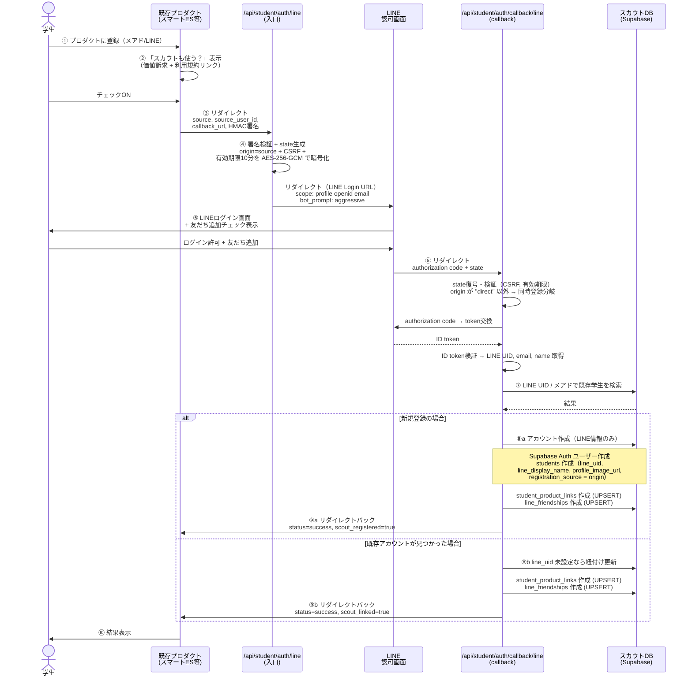

# 同時登録基盤 設計書

## 1. 背景と方針

### 現状の課題

現状の設計では、学生がスカウトサービスに能動的に登録する前提だった。
あるべき姿は、**スマートES等の既存プロダクトに登録した時点で、スカウトサービスにも同時に登録される**状態。

### 方針決定事項

| 項目 | 決定内容 |
|---|---|
| 開発順序 | スカウト単体を先に作り、後から同時登録を繋ぎ込む。ただしスキーマは同時登録前提で設計 |
| LINE連携方式 | パターン1: 同時登録を選んだらその場でLINE連携（オプトイン型） |
| 登録フローのオーナー | スカウト側（リダイレクト型）。プロダクト側はリンク設置のみ |
| LINE公式アカウント | 全プロダクト共通（kokoshiro名義）を新設 |
| スカウト利用の前提 | LINE連携が必須。LINE連携しない学生はスカウト対象外 |
| 認証エンドポイント | 直接ログインと同時登録を **統合エンドポイント** で処理。`source` パラメータの有無で分岐 |

---

## 2. 全体アーキテクチャ

直接ログインと同時登録は、入口 `GET /api/student/auth/line` と callback `GET /api/student/auth/callback/line` を共有する。
入口では `source` パラメータの有無で経路を判定し、state の `origin` フィールドに書き込む。
callback では state の `origin` で分岐する。

```
┌──────────────────────────────────────┐  ┌──────────────────────────────────────┐
│ スカウトのログイン画面               │  │ 既存プロダクト（スマートES等）       │
│                                      │  │                                      │
│ 「LINEでログイン」押下               │  │ 「スカウトと連携する」ボタン押下     │
└───────────────┬──────────────────────┘  └───────────────┬──────────────────────┘
                │ GET /api/student/auth/line              │ GET /api/student/auth/line
                │ （パラメータなし）                      │ ?source=&source_user_id=
                │                                         │  &callback_url=&signature=
                ▼                                         ▼
          ┌─────────────────────────────────────────────────────┐
          │ /api/student/auth/line  （統合エントリポイント）    │
          │                                                     │
          │ source あり:                                        │
          │   - HMAC署名検証                                    │
          │   - state.origin = source（プロダクト識別子）       │
          │ source なし:                                        │
          │   - state.origin = "direct"                         │
          │                                                     │
          │ state を AES-256-GCM で暗号化 → LINE 認可URLへ      │
          └─────────────────────────┬───────────────────────────┘
                                    │ redirect
                                    ▼
          ┌─────────────────────────────────────────────────────┐
          │ LINE 認可画面                                       │
          │  - LINEログイン                                     │
          │  - 友だち追加チェック（bot_prompt=aggressive）      │
          └─────────────────────────┬───────────────────────────┘
                                    │ callback（code + state）
                                    ▼
          ┌─────────────────────────────────────────────────────┐
          │ /api/student/auth/callback/line  （統合callback）   │
          │                                                     │
          │ state.origin で分岐:                                │
          │   "direct"  → Supabase Auth セッション確立          │
          │              → /student/dashboard                   │
          │   それ以外 → アカウント作成/紐付け                  │
          │              → callback_url にリダイレクトバック    │
          └─────────────────────────────────────────────────────┘
```

---

## 3. 登録フロー詳細

### 3.1 同時登録フロー（プロダクト経由の新規登録）



> 将来: プロダクト側API（`GET /api/scout-integration/user/:user_id` — 4.3参照）を叩いて氏名・大学等を取り込む拡張を予定している。現在の実装では呼び出していないため、学生にはスカウト側プロフィール画面で自己入力してもらう運用。

### 3.2 直接ログインフロー

スカウトのログイン画面から LINE でスカウトアカウントにログインするフロー。
同時登録と**同じエンドポイントを共有**し、`source` パラメータの有無で分岐する。

```
学生がスカウトログイン画面で「LINEでログイン」押下
  ↓
GET /api/student/auth/line  （パラメータなし）
  ↓
state.origin = "direct" として暗号化 → LINE認可画面へ
  ↓
LINEログイン + 友だち追加
  ↓
GET /api/student/auth/callback/line
  ↓
state.origin が "direct" → 直接ログイン分岐
  ↓
既存学生なら LINE 情報更新 / 新規なら作成
  ↓
Supabase Auth セッション確立（magiclink 発行 + verifyOtp）
  ↓
/student/dashboard にリダイレクト
```

### 連携パターン一覧（2×2×2 = 8パターン）

| # | スカウト | プロダクト | 紐付け | 対応 |
|---|---|---|---|---|
| 1 | 未登録 | 未登録 | なし | 対象外。どちらも使っていない |
| 2 | 未登録 | 未登録 | あり | ありえない（両方未登録なので紐付け不可） |
| 3 | 未登録 | 登録済み | なし | プロダクト登録フロー or 設定画面から → 3.1 新規分岐 |
| 4 | 未登録 | 登録済み | あり | ありえない（スカウト未登録なので紐付け不可） |
| 5 | 登録済み | 未登録 | なし | プロダクト登録時に連携 → 3.1 既存分岐 |
| 6 | 登録済み | 未登録 | あり | ありえない（プロダクト未登録なので紐付け不可） |
| 7 | 登録済み | 登録済み | なし | プロダクト設定画面から → 3.3 |
| 8 | 登録済み | 登録済み | あり | 連携済み。何もしない（再連携時はUPSERTで重複無視） |

### 3.3 後から連携フロー（スカウトとプロダクト両方に登録済み、未紐付け）

スカウトにもプロダクトにも登録済みだが、紐付けができていない学生が連携するフロー。
プロダクト側の設定画面から連携を開始する。

#### 前提

- 学生は既にスカウトにLINE登録済み（students レコード + LINE UID あり）
- 学生はスマートES等にも登録済み
- この2つが同一人物として紐付いていない（student_product_links にレコードがない）

#### フロー

プロダクト側の設定画面から `/api/student/auth/line` に `source` 付きでリダイレクトする。**エンドポイントは 3.1 と同じ。**
callback で既存アカウントが見つかるため、3.1 のシーケンス図の「既存アカウントが見つかった場合」分岐で処理される。

```
プロダクトの設定画面で「スカウトと連携する」ボタン
  ↓
/api/student/auth/line?source=...&... にリダイレクト（3.1 と同じ）
  ↓
LINE認証（スカウトで使用したLINEアカウントでログイン）
  ↓
callback で LINE UID から既存スカウトアカウント発見
  ↓
student_product_links にレコード作成（紐付けのみ。個人情報の取得・更新はしない）
  ↓
プロダクトにリダイレクトバック（scout_linked=true）
```

#### プロダクト側の導線

| 場所 | 対象ユーザー | 表示 |
|---|---|---|
| 新規登録フロー | 新規登録する学生 | 「スカウトサービスも利用する」チェックボックス |
| 設定画面・ダッシュボード | 登録済みの学生 | 「スカウトサービスと連携する」ボタン |

どちらも同じ `/api/student/auth/line` にリダイレクトする。処理フローは同一。

### 3.4 異常系・分岐

| ケース | 挙動 |
|---|---|
| LINE認可をキャンセル | state が復号でき callbackUrl があれば元プロダクトに戻す（status=error&error_message=...）。直接ログイン or 復号失敗なら /student/login にエラー付きで戻す |
| 友だち追加をスキップ | アカウント作成は可能。line_friendships に is_friend=false で記録。LINE通知は送れない |
| 既にスカウトアカウントが存在（メアド重複） | 既存アカウントにLINE UIDを紐付け。新規作成はしない |
| LINE にメアド未登録 | LINE UIDベースの仮メアド（`{uid}@line.scout.local`）で作成。学生が後からプロフィール画面で変更 |
| state の有効期限切れ | 10分超過で復号時に例外。エラーハンドラで元プロダクト or /student/login へ戻す |
| 既に紐付け済みのプロダクトで再度連携ボタンを押した | `student_product_links` / `line_friendships` の UPSERT で重複無視。正常完了（scout_linked=true）を返す |

### 3.5 既存ユーザーの扱い

同時登録機能リリース前に既存プロダクトに登録済みの学生への対応:

| 方式 | 説明 |
|---|---|
| プロダクト内告知 | 既存プロダクトのダッシュボードやLINE通知（公式アカウント友だちの場合）で「スカウトサービスが使えるようになりました」と案内 |
| 導線設置 | プロダクト内に常設の「スカウトに登録する」ボタンを設置。新規登録フローと同じリダイレクト型で処理 |
| 一括移行はしない | 同意取得が必要なため、学生の能動的なアクションが必須 |

---

## 4. API仕様

### 4.1 スカウト側: 認証エントリポイント

**GET /api/student/auth/line**

直接ログインと同時登録を処理する統合エンドポイント。`source` パラメータの有無で分岐する。

#### 同時登録モード（`source` あり）

プロダクト側がリダイレクトする先。

| パラメータ | 型 | 必須 | 説明 |
|---|---|---|---|
| source | string | YES | 元プロダクト識別子（`smartes` / `interviewai` / `compai` / `sugoshu`） |
| source_user_id | string | YES | プロダクト側のユーザーID |
| callback_url | string | YES | 登録完了後の戻り先URL |
| signature | string | YES | HMAC-SHA256署名。`source + source_user_id + callback_url` をプロダクト固有の共有シークレットで署名 |

検証:
- signature の検証（プロダクトごとのシークレットキーで検証。`timingSafeEqual` 使用）
- callback_url がホワイトリストに含まれること（`ALLOWED_CALLBACK_*` 環境変数）
- source が有効な enum 値であること

state の `origin` フィールドに `source` の値が入る。

#### 直接ログインモード（パラメータなし）

スカウトのログイン画面から呼ばれる。state の `origin` フィールドに `"direct"` が入る。

#### state 構造

AES-256-GCM（`SCOUT_STATE_ENCRYPTION_KEY`）で暗号化して LINE Login の `state` パラメータに渡す。

| フィールド | 型 | 説明 |
|---|---|---|
| origin | string | `"direct"` またはプロダクト識別子 |
| sourceUserId | string? | 同時登録時のみ |
| callbackUrl | string? | 同時登録時のみ |
| csrfToken | string | CSRF対策トークン（HttpOnly cookie `scout_csrf` に同じ値を保存） |
| expiresAt | number | 有効期限（Unix timestamp、10分） |

### 4.2 スカウト側: LINE callback エンドポイント

**GET /api/student/auth/callback/line**

LINE Login の認可コード受け取り。外部から直接呼ばない。

処理フロー:
1. state を復号・検証（CSRF cookie 突合、有効期限）
2. authorization code → token exchange（ID token 取得）
3. ID token 検証 → LINE UID / メアド / 表示名 / 画像 を取得
4. `state.origin` で分岐:
   - `"direct"` → **直接ログイン分岐**
   - それ以外 → **同時登録分岐**

#### 直接ログイン分岐

1. 既存学生を検索（LINE UID → メアド）
2. 見つかれば LINE 情報更新（`user_metadata` + `profile_image_url`）、なければ新規作成（Supabase Auth + students）
3. magiclink を発行し `verifyOtp` で Cookie ベースのセッション確立
4. `/student/dashboard` にリダイレクト

#### 同時登録分岐

1. 既存学生を検索（LINE UID → メアド）
2. 見つかれば line_uid 未設定の場合のみ紐付け。なければ新規作成（**現状は LINE 情報のみ**。プロダクトAPIからの個人情報取得は未実装）
3. `student_product_links` に UPSERT（`onConflict: student_id,product`）
4. `line_friendships` に UPSERT（`onConflict: student_id`）
5. `callback_url` にリダイレクトバック
   - 新規: `?status=success&scout_registered=true`
   - 既存: `?status=success&scout_linked=true`

### 4.3 プロダクト側: ユーザー情報取得API（将来実装）

**GET /api/scout-integration/user/:user_id**

スカウトのcallbackから呼び出される想定のプロダクト側API。
**現在のスカウト実装からは呼び出していない。** 学生は登録後にスカウト側プロフィール画面で情報を補完する運用。
将来、同時登録時点で個人情報も取り込む拡張を行う際に有効化する。

リクエストヘッダ:
```
Authorization: Bearer {scout_api_key}
```

レスポンス例:
```json
{
  "user_id": "xxx",
  "email": "user@example.com",
  "last_name": "田中",
  "first_name": "太郎",
  "last_name_kana": "タナカ",
  "first_name_kana": "タロウ",
  "university": "東京大学",
  "faculty": "工学部",
  "graduation_year": 2027,
  "academic_type": "science"
}
```

レスポンスフィールドはプロダクトごとに異なる（持っている情報が違う）。
スカウト側は存在するフィールドのみ取り込み、不足分はプロフィール補完画面で学生に入力させる。

各プロダクトが返せるフィールド:

| フィールド | スマートES | 面接AI | 企業分析AI | すごい就活 |
|---|---|---|---|---|
| email | ○ | ○ | ○ | ○ |
| 氏名 | 要確認 | 要確認 | 要確認 | 要確認 |
| 大学名 | 要確認 | 要確認 | 要確認 | 要確認 |
| 卒業年度 | 要確認 | 要確認 | 要確認 | 要確認 |

※ 各プロダクトが保持するデータの詳細は別途調査が必要

### 4.4 セキュリティ要件

| 要件 | 対策 |
|---|---|
| プロダクト認証 | プロダクトごとの共有シークレットでHMAC署名を検証。`timingSafeEqual` でタイミング攻撃対策 |
| CSRF | state に csrfToken を埋め、HttpOnly cookie (`scout_csrf`) と突合 |
| state 改ざん防止 | AES-256-GCM で暗号化（`SCOUT_STATE_ENCRYPTION_KEY`） |
| リダイレクト先の制限 | callback_url をホワイトリストで検証（`ALLOWED_CALLBACK_*`） |
| 個人情報の保護 | URLパラメータに個人情報を含めない |
| 有効期限 | state に `expiresAt` を含め、10分で失効 |
| 通信 | 全通信HTTPS |

---

## 5. LINE Login 設定

### 5.1 LINE Developers コンソール設定

| 項目 | 設定値 |
|---|---|
| チャネルタイプ | LINE Login |
| プロバイダー | kokoshiro（全プロダクト共通プロバイダー） |
| ボットリンク機能 | 有効 |
| リンクするボット | kokoshiro LINE公式アカウント |
| Callback URL | `https://{scout-domain}/api/student/auth/callback/line` |
| スコープ | `profile`, `openid`, `email` |

### 5.2 LINE公式アカウント（Messaging API）

| 項目 | 設定値 |
|---|---|
| アカウント名 | 要検討（「kokoshiro」or プロダクト横断の名称） |
| プロバイダー | kokoshiro（LINE Loginと同一プロバイダー。同一プロバイダー内ならLINE UIDが共通） |
| Webhook | 有効（follow/unfollow イベントで line_friendships を更新） |

### 5.3 重要: LINE UIDの一貫性

LINE UIDはプロバイダー単位で一意。同一プロバイダー配下のチャネルであれば、LINE Login と Messaging API で同じ LINE UID が返る。

→ LINE Login チャネルと LINE公式アカウント（Messaging API チャネル）を**同一プロバイダーに配置する**こと。

---

## 6. スキーマ変更

### 6.1 students テーブルにカラム追加

| カラム | 型 | 説明 |
|---|---|---|
| `line_uid` | `TEXT UNIQUE` | LINE連携時に取得するLINE UID。LINEログインで使用 |
| `line_display_name` | `TEXT` | LINE表示名。プロフィール表示用 |
| `registration_source` | `product_source` | どのプロダクト経由で登録されたか。直接登録の場合は NULL |

- `line_uid` にはユニークインデックスを付与する（LINE UID でのログイン検索用）
- 既存の `product_source` enum をそのまま利用可能

### 6.2 新規テーブル: line_friendships

LINE公式アカウントの友だち追加状態を管理する。

```sql
CREATE TABLE line_friendships (
  id            UUID        PRIMARY KEY DEFAULT gen_random_uuid(),
  student_id    UUID        NOT NULL REFERENCES students(id),
  line_uid      TEXT        NOT NULL,
  is_friend     BOOLEAN     DEFAULT true,
  followed_at   TIMESTAMPTZ DEFAULT now(),
  unfollowed_at TIMESTAMPTZ,
  created_at    TIMESTAMPTZ DEFAULT now(),
  updated_at    TIMESTAMPTZ DEFAULT now()
);
```

- LINE Webhook（follow/unfollow イベント）で更新
- 通知送信時にこのテーブルで友だち状態を確認してから送る

### 6.3 student_product_links の役割整理

| 役割 | 管理先 |
|---|---|
| 認証連携（どのプロダクト経由でアカウントが作られたか） | `students.registration_source` |
| データ同期連携（どのプロダクトのデータを連携しているか） | `student_product_links`（従来通り） |

同時登録時、`student_product_links` にも自動でレコードを作成する（登録元プロダクトとのデータ連携を即座に有効化）。

### 6.4 product_source enum への追加

既存: `interviewai`, `compai`, `smartes`, `sugoshu`

変更なし。`registration_source` で使う値は既存の enum で足りる。
`scout`（直接登録）は NULL で表現するため、enum追加は不要。

### 6.5 変更しないもの

以下は今回のスキーマ変更の対象外。現状のまま維持する。

- `companies`, `company_members`, `job_postings` — 企業側は影響なし
- `scouts`, `chat_messages` — コア機能は不変
- `events`, `event_registrations` — 不変
- `synced_*` テーブル群 — データ同期の構造自体は不変
- `student_integrated_profiles` — 不変
- `notifications`, `*_notification_settings` — 既に `line_sent_at` があり追加不要

---

## 7. 要件定義書への影響

以下の箇所を更新する必要がある。

### 7.1 セクション10.1「学生側」

| 現行 | 変更後 |
|---|---|
| ログイン: LINE連携 or マジックリンク | ログイン: **LINE連携必須**。マジックリンクは廃止 |
| データ連携画面: ON/OFF切り替え | 同時登録済みのプロダクトは自動でON。追加プロダクトの連携は従来通り |

### 7.2 セクション10.1「システム基盤」

追加:

| 機能 | 概要 |
|---|---|
| 同時登録API | 既存プロダクトからのリダイレクト受付 → LINE認証 → アカウント作成 → リダイレクトバック |
| プロダクト間ユーザー情報取得API | 各プロダクトが提供する（将来実装）。スカウト側がcallback時に呼び出し |
| LINE公式アカウント連携 | Bot Link による友だち追加。Webhook による友だち状態管理 |

### 7.3 セクション6.3「認証方式」

| 現行 | 変更後 |
|---|---|
| 学生: LINE連携（推奨）or マジックリンク | 学生: **LINE連携のみ** |

### 7.4 認証方式テーブル

| ユーザー種別 | 認証方式 | 備考 |
|---|---|---|
| 学生（同時登録） | LINE Login（Bot Link経由） | 既存プロダクトからのリダイレクトフローで完結 |
| 学生（直接登録） | LINE Login | スカウト単体での登録。将来的に廃止の可能性あり |
| 企業 | マジックリンク + MFA（変更なし） | |

---

## 8. 実装順序

### Phase 1: スカウト単体 + 統合認証エンドポイント（完了済み）

- LINE Login による直接ログイン
- 統合エンドポイント `GET /api/student/auth/line` / `GET /api/student/auth/callback/line`
- `state.origin` による分岐処理（direct / プロダクト識別子）
- students に line_uid / line_display_name / registration_source を追加、line_friendships テーブル作成
- 同時登録からも呼べるよう、HMAC検証・state 暗号化・CSRF対策を実装済み

### Phase 2: プロダクト側接続（本ドキュメントのスコープ）

- 各プロダクトにリダイレクトリンク設置（[08ドキュメント](08-product-side-tasks.md)参照）
- HMAC署名用の共有シークレット発行・配布
- callback_url ホワイトリスト登録
- LINE Developers コンソール設定（Bot Link有効化）
- 接続テスト

### Phase 3: 個人情報取り込みの拡張（将来）

- プロダクト側ユーザー情報取得API（`/api/scout-integration/user/:user_id`）の仕様確定
- callback から同APIを呼び出して students に氏名等を取り込む処理の実装
- 各プロダクトで返せるフィールドの確定

### Phase 4: 各プロダクトとの接続

- スマートES → スカウト連携（最優先。LINEログイン既存のため）
- 面接練習AI → スカウト連携
- 企業分析AI → スカウト連携
- すごい就活 → スカウト連携

---

## 9. 更新対象ファイル

| ファイル | 更新内容 |
|---|---|
| `docs/development/03-00-schema.md` | テーブル定義の追記・更新 |
| `docs/requirements_definition.md` | セクション 6.3, 10.1 の認証方式・機能一覧更新 |
| `supabase/migrations/` | 新規マイグレーション（ALTER TABLE + CREATE TABLE） |
| RLS ポリシー | line_friendships の RLS 追加 |

---

## 10. 未決事項

| 項目 | 内容 | 決定時期 |
|---|---|---|
| LINE公式アカウント名 | 「kokoshiro」で良いか、別の名称にするか。見え方の設計 | LINE設計フェーズ |
| 各プロダクトが返せるユーザー情報 | 氏名・大学名等をどのプロダクトが持っているか | プロダクト側調査 |
| オプトイン率の目標値 | 「スカウトも使う？」のチェック率の目標 | ビジネス側と協議 |
| デフォルトON/OFF | チェックボックスの初期状態 | 法務確認 |
| LINE にメアド未登録の学生への対応 | プロダクト側メアドで代替するが、LINEからメアド取得できない旨の説明が必要か | 法務確認 |
| 既存ユーザーへの告知方法 | プロダクト内告知の具体的なUI・コピー | デザインフェーズ |
