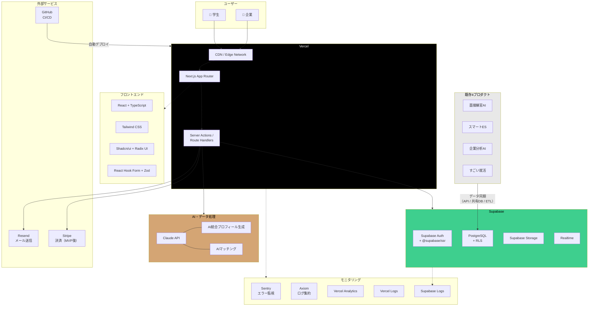

# スカウトサービス 要件定義書

ver1 | 2026年3月20日 作成

参加者: [福田岳飛](mailto:g.fukuda@kokoshiro.co.jp) [松井良太](mailto:r.matsui@kokoshiro.co.jp) [大嶋泰智](mailto:t.oshima@kokoshiro.co.jp)

---

## 🔴1. プロジェクト背景

### 1.1 現状

- 自社プロダクト4つ: **面接練習AI**、**スマートES**、**企業分析AI**、**すごい就活**
- 合計月間新規登録者数: **約6,000人**
- 就活生の行動データ（ES作成、企業分析、面接練習）が各プロダクトに蓄積されている

### 1.2 仮説

月6,000人の登録者がいるなら、その就活生データを企業側に提供するスカウトサービスを構築すれば、ビジネスとして成立するのではないか

### 1.3 コアコンセプト

各プロダクトに分散している就活生データを**一元化**し、企業が就活生を検索・スカウトできるプラットフォームを構築する。

統合対象データ:

| データソース | 統合するデータ |
| :---- | :---- |
| スマートES | 生成したES（自己PR、ガクチカ等） |
| 企業分析AI | 調べた企業・業界情報、志望動機 |
| 面接練習AI | 練習内容、回答傾向、スキルレベル |
| すごい就活 | プロフィール情報、就活状況 |

---

## 🔴2. ビジョンステートメント

> 使うだけで就活が終わるAIと、行動データが生む本質的なマッチングで、学生と企業の出会いを変える

### 2.1 誰の・どんな課題を・どう解決するか

#### toC（学生向け）

| 項目 | 内容 |
| :---- | :---- |
| 誰の | 就活めんどくさいけど楽したい学生 |
| どんな課題を | 書類作ったり、ES書いたりがめんどくさい |
| どう解決する | 履歴書からESまで全部作ってくれるAIのシステム使うだけで企業からスカウトが届くサービス |

#### toB（企業向け）

| 項目 | 内容 |
| :---- | :---- |
| 誰の | 新卒採用をしている企業 |
| どんな課題を | マッチングの質が低く、内定辞退率が高い / 運用工数が多く、RPOの依頼をする必要がある |
| どう解決する | 学生の行動をベースとした本質的なマッチングを提供 / 高精度なフィルタリングと一括配信による工数の削減 |

### 2.2 ビジョンとMVPの関係

```
学生が既存プロダクトを使う
    ↓ データが自然に溜まる
スカウトサービスでデータ統合
    ↓ Claude APIが学生の本質を可視化
企業がスカウト送信
    ↓ 行動データに基づくマッチング
学生にスカウトが届く
```

MVPではこの一連の体験を最小限で成立させる。

---

## 🔵3. ビジネスモデル

### 3.1 課金モデル候補

- 採用ベースの成果報酬型
- 月額固定
- スカウト送信従量課金
- フリーミアム

### 3.2 検討事項

- 学生側は無料か有料か
- 初期の売上目標・KPI設定
- 競合の料金水準（#7）を参考にした価格帯の仮設定

※ 課金形態は Phase 4 で実装。MVP段階では仮のスカウト送信上限（例: 月30通）を設定。

---

## 🔴4. プロダクト原則・やらないこと

### 4.1 プロダクト原則

迷ったときに何を優先するかの判断基準。

- 高度な機能 ＜ **手軽さ**
- 多くの選択肢 ＜ **シンプルで迷いのない選択肢**

### 4.2 やらないこと

- **toB**: 学生の検索機能

---

## 🔴6. 技術スタック

### 技術スタック全体図



### 6.1 フロントエンド

| 技術 | 用途 |
| :---- | :---- |
| **Next.js (App Router)** | フレームワーク。Server Componentsでの高速描画、Server Actions / Route HandlersによるAPI層。既存4プロダクトと統一 |
| **React** | UIライブラリ |
| **TypeScript** | 型安全性の確保。チーム開発でのバグ抑制・コード品質向上 |
| **Tailwind CSS** | スタイリング。ユーティリティファーストで高速UI開発 |
| **Shadcn/ui + Radix UI** | UIコンポーネント基盤。企業ダッシュボード・フォーム・テーブル・モーダル等 |

---

### 6.2 バックエンド・データベース

| 技術 | 用途 |
| :---- | :---- |
| **Supabase** | BaaS基盤。PostgreSQL DB / Storage / Realtimeを統合提供。既存4プロダクトと統一 |
| **Next.js Server Actions / Route Handlers** | API層。スカウト送信・AIマッチング・データ同期などのサーバーサイドロジック |

---

### 6.3 認証・権限管理

| 技術 | 用途 |
| :---- | :---- |
| **Supabase Auth** | 認証基盤。学生: LINE連携 or マジックリンク、企業: マジックリンク + MFA（TOTP） |
| **@supabase/ssr** | Cookie ベースのセッション管理。Next.js App Router との統合 |
| **Row Level Security (RLS)** | DBレベルのアクセス制御。学生は自分のデータのみ、企業は審査完了後に公開プロフィールのみ閲覧可等 |

#### 認証方式

| ユーザー種別 | 認証方式 | 備考 |
| :---- | :---- | :---- |
| 学生 | **LINE連携（推奨）** or **マジックリンク** | LINE連携はOAuthフロー内で完結するためトラッキング情報が維持されやすい |
| 企業（owner/admin） | **マジックリンク + MFA（TOTP必須）** | パスワードレスでフィッシングリスク排除。MFAでセキュリティ強化 |
| 企業（member） | **マジックリンク** | MFAは任意 |

※ 将来的にエンタープライズ企業向けにSSO（SAML）対応を追加する余地を残す。

ロール設計・セッション管理・MFA要件の詳細は [セキュリティ要件書](operations/02-security-requirements.md) を参照。

---

### 6.4 AI・データ処理

| 技術 | 用途 |
| :---- | :---- |
| **Claude API** | AI統合プロフィール生成（4プロダクトのデータを分析→summary, strengths, skills等を生成）、AIマッチング（企業の採用条件と学生データの照合） |

---

### 6.5 データ連携

| 技術 | 用途 |
| :---- | :---- |
| **Supabase間API / 共有DB / ETL**（方式未定） | 既存4プロダクト（面接練習AI・スマートES・企業分析AI・すごい就活）からのデータ同期。synced_* テーブルへの取り込み |

データ連携方式は開発フェーズで決定。各プロダクトのDB構造調査後に最適な方式を選定する。

---

### 6.6 インフラ・デプロイ

| 技術 | 用途 |
| :---- | :---- |
| **Vercel** | ホスティング・CDN。Next.jsの最適デプロイ先、自動プレビュー環境、WAF Rate Limiting |
| **GitHub** | ソース管理・CI/CD。Vercelとの自動デプロイ連携、PRレビュー運用、Dependabot |

---

### 6.7 モニタリング・分析

| 技術 | 用途 |
| :---- | :---- |
| **Sentry** | エラー監視・パフォーマンス計測。Next.js統合（`@sentry/nextjs`）でサーバー/クライアント両方のエラーを自動キャプチャ |
| **Axiom** | ログ集約・分析。構造化ログの検索・ダッシュボード可視化 |
| **Vercel Analytics** | アクセス解析。ページパフォーマンス・Web Vitals計測 |
| **Vercel Logs** | アプリケーションログ。API Routeの構造化ログ確認 |
| **Supabase Dashboard Logs** | Auth ログ・DBクエリログ。ログイン試行・RLSポリシー評価の監視 |

---

### 6.8 テスト・品質保証

| 技術 | 用途 |
| :---- | :---- |
| **Vitest** | ユニットテスト。バリデーションロジック・ユーティリティ関数のテスト |
| **Playwright** | E2Eテスト。スカウト送信フロー・データ連携同意フローの統合テスト |
| **ESLint + Prettier** | コード品質・フォーマット統一 |

---

### 6.9 その他

| 技術 | 用途 |
| :---- | :---- |
| **Resend** | メール送信。スカウト受信通知、企業審査完了通知、メール認証 |
| **Stripe** | 決済基盤。企業向けプラン管理・スカウト送信上限制御（MVP後に実装） |
| **Supabase Storage** | ファイル管理。プロフィール画像・履歴書等。Privateバケット + 署名付きURL |
| **Zod** | バリデーション。サーバー側API入力検証・クライアント側フォームバリデーション |
| **React Hook Form** | フォーム管理。企業情報登録・スカウト作成・プライバシー設定等の複雑なフォーム処理 |

---

## 🔵7. 開発スケジュール

### 全体タイムライン

あとから入れる

---

## 🔵8. 技術的に重要な検討事項

- **データ連携方式**: 各プロダクトのDBからどうデータを引っ張るか（API連携 / 共有スキーマ / ETL）→ P2-1 で決定
- **プライバシー・同意管理**: 学生がどのデータを公開するか制御する仕組み → [セキュリティ要件書](operations/02-security-requirements.md) セクション7 で設計済み
- **検索基盤**: 学生数が増えた場合の検索パフォーマンス（Supabase Full-Text Search → 将来的にElasticsearch等）

---

## 🔵9. リスク・懸念事項

| リスク | 影響度 | 対策 |
| :---- | :---- | :---- |
| ビジョン未確定のまま開発着手 | **致命的** | Phase 0を絶対にスキップしない |
| 既存プロダクトのデータ連携が技術的に困難 | 高 | P1-1 で早期にDB構造調査 |
| 学生のデータ公開への抵抗 | 高 | P0-7 でアンケート実施、P1-5 で同意フロー設計 |
| 並行開発によるリソース不足 | 中 | 優先順位を明確化、Phase 2 以降で全員稼働 |
| 競合との差別化が弱い | 高 | 「既存データ統合」の独自価値を磨く |
| 個人情報保護法への対応 | 高 | [セキュリティ要件書](operations/02-security-requirements.md) セクション7で対応済み（同意管理・公開範囲制御・退会時データ削除・保護法チェックリスト） |
| 企業側の学生管理機能のスコープ未定 | 高 | スカウト送信後の学生管理をどこまで担うか要決定。スカウト承諾/辞退の管理だけに留めるのか、選考状況（面接日程・合否・内定承諾等）のトラッキングまで持つのかで、DB設計・UI・工数が大きく変わる。ATS（採用管理システム）との棲み分けも含めて Phase 0 で方針を決める |
| エージェント（人材紹介）アカウントの要否 | 中 | 企業の直接求人だけでなく、人材紹介エージェントにもアカウントを開放するかを検討。対応する場合、ロール設計・料金体系・学生への見え方が変わる。Phase 0 で方針を決める |

---

## 🔴10. MVP要件定義

### 10.1 Must（必須）— これがないとMVPとして成立しない

#### 学生側

| 機能 | 概要 | 根拠 |
| :---- | :---- | :---- |
| ログイン（LINE連携 or マジックリンク） | LINE連携を推奨、マジックリンクも選択可。既存アカウントとはメールアドレスで紐付け | 「使うだけで」の体験の起点。LINE連携はトラッキング情報が維持されやすい |
| データ連携画面 | 各プロダクトとの連携状態の確認・ON/OFF切り替え。同意取得（利用規約承認 → data_consent_granted_at記録）を含む | 個人情報保護法対応・信頼の基盤。どのデータが連携されるか学生が把握・制御できる |
| プロフィール作成 | 個人情報、スカウトとか各種設定 | 学生情報入力しないと始まらない |
| プロフィール確認画面 | 基本情報 + AI統合プロフィール + 各プロダクト同期データの閲覧 | 自分のデータが何を見られるか把握できる |
| プロフィール公開ON/OFF | is_profile_public の切り替え | 企業に見つけてもらうための最終スイッチ |
| スカウト受信・閲覧 | 受信一覧、詳細表示、既読管理 | コア体験のゴール |
| スカウト承諾/辞退 | ステータス変更（accepted / declined） | マッチング成立の最終ステップ |
| チャット | スカウト承諾後に企業担当者とメッセージのやり取り。スカウト単位のスレッド形式 | 承諾後の次のアクション（面談日程調整等）をサービス内で完結させる |
| 「企業からこう見えます」プレビュー | 学生が公開設定後に企業視点で確認できる | 手軽さ・安心感（プロダクト原則に合致） |
| イベント閲覧・申し込み | 企業主催・運営主催のイベント（説明会・セミナー・インターン等）の一覧閲覧、詳細確認、参加申し込み・キャンセル | スカウト以外の企業接点。イベント参加をきっかけにした自然なマッチングの促進 |

#### 企業側

| 機能 | 概要 | 根拠 |
| :---- | :---- | :---- |
| 企業アカウント登録・ログイン | 企業情報 + 担当者情報の登録、マジックリンク認証。owner/adminはMFA（TOTP）必須 | 企業側の入口。パスワードレスでフィッシングリスク排除 |
| 企業プロフィール編集 | 企業情報（社名、業界、所在地、企業紹介文、ロゴ等）の編集。学生がスカウト受信時に閲覧する企業情報の管理 | 学生がスカウト元企業を判断するための情報源 |
| 求人管理 | 求人の作成・編集・公開/非公開切り替え。職種、勤務地、募集要項等の入力。スカウト送信時に求人を紐付け | スカウトに具体的なポジション情報を付与。学生の意思決定を促進 |
| 企業アカウント審査フロー | 登録直後は is_verified=false。運営が審査完了するまで学生データ閲覧・スカウト送信不可。審査完了後にメール通知 | なりすまし防止。[セキュリティ要件書](operations/02-security-requirements.md) 2.2 で定義 |
| AIマッチング・フィルタリング | 企業の採用条件をもとにAIがマッチ度の高い学生リストを自動生成。フィルター（卒業年度、文理、活動量等）で絞り込み | 「本質的なマッチング」の実現。企業が手動で検索する工数を削減 |
| 学生プロフィール詳細閲覧 | AI統合プロフィール + 各プロダクトデータ（privacy_settingsに基づく表示制御） | 行動データから学生の本質を見る |
| スカウト一括配信 | マッチした学生リストから複数人を選択し、スカウトを一括送信。件名 + 本文入力、送信確認、重複防止 | 運用工数の削減（RPO不要に） |
| スカウト送信プレビュー | 送信前に内容を確認 | 送信ミス防止 |
| スカウト管理 | 送信済み一覧、ステータス確認（送信/既読/承諾/辞退） | 採用活動の管理 |
| チャット | スカウト承諾済みの学生とメッセージのやり取り。スカウト単位のスレッド形式 | 承諾後のコミュニケーション（面談日程調整等）をサービス内で完結させる |
| ダッシュボード（最小版） | スカウト送信数、承諾率、最近の活動、AIおすすめ学生 | ログイン後の起点 |
| イベント管理 | 説明会・セミナー・インターン等のイベント作成・編集・公開/非公開切り替え。オンライン/オフライン/ハイブリッド対応、定員設定、申し込み期限設定。参加申し込み学生の一覧確認・ステータス管理 | スカウト以外の企業接点。企業の採用活動を多角化 |
| メンバー招待 | owner が担当者を追加招待 | 企業内で複数人運用 |

#### システム基盤

| 機能 | 概要 | 根拠 |
| :---- | :---- | :---- |
| 4プロダクトからのデータ同期 | ETL方式で各プロダクトDBからデータを抽出・変換し synced_* テーブルに格納。リアルタイム性が必要になった場合にAPI連携を検討。連携元プロダクトのメール検証状態を確認し、未検証アカウントは連携候補から除外。連携時はデータプレビューを表示し学生に確認を取る | 全ての価値の源泉。※ UIを先行して統一構築し、データ連携基盤は後続で実装 |
| AI統合プロフィール生成 | Claude APIで4プロダクトデータを分析 → summary, strengths, skills等を生成 | 「学生の本質を可視化」の実現。※ データ連携基盤の完成後に実装 |
| RLS + 認証基盤 | 学生/企業の認証、テーブルごとのアクセス制御、MFA（owner/admin必須）、セッション管理 | セキュリティの根幹。詳細は [セキュリティ要件書](operations/02-security-requirements.md) 参照 |
| 通知基盤 | スカウト受信・チャット新着・承諾/辞退等のイベント通知。LINE通知を基本チャネルとし、アプリ内通知も併用。ユーザーごとの通知設定（通知種別ごとのON/OFF）対応 | LINEは開封率が高く即時性がある。サービス内のアクションに気付かず放置されるリスクの軽減 |
| 流入経路トラッキング | マジックリンク認証時のアクセス元追跡。初回アクセス時にUTM/referrerをサーバー側DBに匿名セッションIDで保存し、認証コールバック時にユーザーIDと紐付け。有効期限30分・使い捨て | WebView/アプリ内ブラウザでcookieが消える問題を回避。登録導線の分析に必須 |
| 運営イベント管理 | 運営主催の合同企業説明会・セミナー等を作成・管理。企業主催イベントと同じ仕組みで管理 | プラットフォームとしての集客・ブランディング |
| 仮のスカウト送信上限 | 無課金でも上限を設定（例: 月30通） | 無制限だとスパム化のリスク |

### 10.2 Should（推奨）— あるとMVPの体験が良くなる

| 機能 | 概要 | 根拠 |
| :---- | :---- | :---- |
| スカウト有効期限 | expires_at を過ぎたら自動で expired に | 放置スカウトの管理 |
| マッチ結果のソート機能 | マッチ度順、活動量順、スキルスコア順、登録日順 | AIマッチング結果の絞り込み体験向上 |

### 10.3 Could（MVP後）— Phase 4 以降で対応

| 機能 | 概要 | 根拠 |
| :---- | :---- | :---- |
| マッチング条件保存 | よく使うマッチング条件を名前付きで保存・再利用 | 繰り返し採用活動を行う企業の運用効率化 |
| Stripe課金基盤 | Stripe連携でプラン管理・スカウト送信上限制御・サブスクリプション管理 | 収益化の基盤。MVP段階では仮上限で運用 |
| プラン管理・請求画面 | 契約プラン確認・変更、請求履歴、支払い方法管理 | 企業が自律的にプラン管理できる体験 |
| LPページ（企業向け） | サービス紹介・機能説明・料金プラン・登録導線 | 企業獲得のための集客チャネル |
| クローズドβ運用 | 企業3〜5社・学生50〜100名で2〜3週間のβテスト、フィードバック収集・分析 | 本格リリース前の品質検証とプロダクト改善 |
| 未認証ユーザー向け公開コンテンツ | ログインなしで求人一覧・イベント一覧等を閲覧可能にする（anonロールへのRLS開放） | マーケティング・集客効果の向上。MVP段階ではanon全拒否で運用 |

