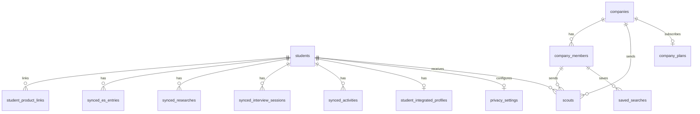
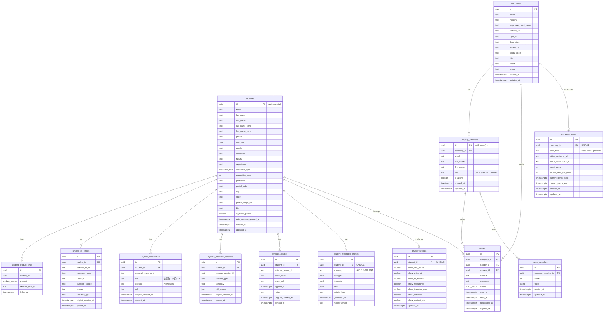

# スカウトサービス データベーススキーマ設計書

## 概要

既存4プロダクト（スマートES / 企業分析AI / 面接練習AI / すごい就活）の学生データを統合し、企業が学生を検索・スカウトできるプラットフォームのデータベース設計。

- **DBMS**: PostgreSQL（Supabase）
- **認証**: Supabase Auth
- **テーブル数**: 13

---

## ER図（概要）



## ER図（詳細）



---

## Enum型

| Enum | 値 | 説明 |
|---|---|---|
| `user_role` | `student`, `company_member`, `admin` | ユーザー種別 |
| `product_source` | `smart_es`, `company_ai`, `interview_ai`, `syukatsu` | 連携元プロダクト |
| `scout_status` | `sent`, `read`, `accepted`, `declined`, `expired` | スカウトの状態遷移 |
| `academic_type` | `liberal_arts`, `science`, `other` | 文理区分 |

---

## テーブル詳細

### 1. students — 学生統合プロフィール

学生の基本情報を一元管理する。`id` は Supabase Auth の `auth.users(id)` と一致。

| カラム | 型 | 制約 | 説明 |
|---|---|---|---|
| id | UUID | PK, FK → auth.users(id) | |
| email | TEXT | NOT NULL, UNIQUE | |
| last_name | TEXT | | 姓 |
| first_name | TEXT | | 名 |
| last_name_kana | TEXT | | 姓カナ |
| first_name_kana | TEXT | | 名カナ |
| phone | TEXT | | 電話番号 |
| birthdate | DATE | | 生年月日 |
| gender | TEXT | | 性別 |
| university | TEXT | | 大学名 |
| faculty | TEXT | | 学部 |
| department | TEXT | | 学科 |
| academic_type | academic_type | | 文理区分 |
| graduation_year | INT | | 卒業年度 |
| prefecture | TEXT | | 都道府県 |
| postal_code | TEXT | | 郵便番号 |
| city | TEXT | | 市区町村 |
| street | TEXT | | 番地以降 |
| profile_image_url | TEXT | | プロフィール画像 |
| bio | TEXT | | 自己紹介文 |
| is_profile_public | BOOLEAN | DEFAULT false | 企業への公開フラグ |
| data_consent_granted_at | TIMESTAMPTZ | | データ連携同意日時 |
| created_at | TIMESTAMPTZ | DEFAULT now() | |
| updated_at | TIMESTAMPTZ | DEFAULT now() | |

### 2. companies — 企業プロフィール

| カラム | 型 | 制約 | 説明 |
|---|---|---|---|
| id | UUID | PK, DEFAULT gen_random_uuid() | |
| name | TEXT | NOT NULL | 企業名 |
| industry | TEXT | | 業界 |
| employee_count_range | TEXT | | 従業員規模（例: "101-500"） |
| website_url | TEXT | | コーポレートサイト |
| logo_url | TEXT | | ロゴ画像 |
| description | TEXT | | 企業説明 |
| prefecture | TEXT | | 都道府県 |
| postal_code | TEXT | | 郵便番号 |
| city | TEXT | | 市区町村 |
| street | TEXT | | 番地以降 |
| phone | TEXT | | 代表電話番号 |
| created_at | TIMESTAMPTZ | DEFAULT now() | |
| updated_at | TIMESTAMPTZ | DEFAULT now() | |

### 3. company_members — 企業担当者

企業に所属するリクルーター。`id` は Supabase Auth の `auth.users(id)` と一致。

| カラム | 型 | 制約 | 説明 |
|---|---|---|---|
| id | UUID | PK, FK → auth.users(id) | |
| company_id | UUID | NOT NULL, FK → companies(id) | 所属企業 |
| email | TEXT | NOT NULL | |
| last_name | TEXT | | 姓 |
| first_name | TEXT | | 名 |
| role | TEXT | DEFAULT 'member' | `owner` / `admin` / `member` |
| is_active | BOOLEAN | DEFAULT true | アカウント有効フラグ |
| created_at | TIMESTAMPTZ | DEFAULT now() | |
| updated_at | TIMESTAMPTZ | DEFAULT now() | |

### 4. student_product_links — プロダクト紐付け

学生アカウントと既存4プロダクトのアカウントを紐付ける。メールアドレスで自動マッチング後、学生の確認を経て作成。

| カラム | 型 | 制約 | 説明 |
|---|---|---|---|
| id | UUID | PK, DEFAULT gen_random_uuid() | |
| student_id | UUID | NOT NULL, FK → students(id) | |
| product | product_source | NOT NULL | 連携元プロダクト |
| external_user_id | TEXT | NOT NULL | プロダクト側のuser_id |
| linked_at | TIMESTAMPTZ | DEFAULT now() | 紐付け日時 |
| | | UNIQUE(student_id, product) | 1プロダクト1リンク |

### 5. synced_es_entries — ES データ（スマートES）

| カラム | 型 | 制約 | 説明 |
|---|---|---|---|
| id | UUID | PK, DEFAULT gen_random_uuid() | |
| student_id | UUID | NOT NULL, FK → students(id) | |
| external_es_id | TEXT | | スマートES側のes_id |
| company_name | TEXT | | 対象企業名 |
| industry | TEXT | | 業界 |
| question_content | TEXT | | 設問内容 |
| answer | TEXT | | 回答内容 |
| selection_type | TEXT | | 選考種別 |
| original_created_at | TIMESTAMPTZ | | 元データの作成日時 |
| synced_at | TIMESTAMPTZ | DEFAULT now() | 同期日時 |

### 6. synced_researches — 企業分析データ（企業分析AI）

| カラム | 型 | 制約 | 説明 |
|---|---|---|---|
| id | UUID | PK, DEFAULT gen_random_uuid() | |
| student_id | UUID | NOT NULL, FK → students(id) | |
| external_research_id | TEXT | | 企業分析AI側のid |
| title | TEXT | | 調査対象（企業名・トピック） |
| content | TEXT | | AI生成の分析結果 |
| url | TEXT | | 関連URL |
| original_created_at | TIMESTAMPTZ | | 元データの作成日時 |
| synced_at | TIMESTAMPTZ | DEFAULT now() | 同期日時 |

### 7. synced_interview_sessions — 面接練習データ（面接練習AI）

| カラム | 型 | 制約 | 説明 |
|---|---|---|---|
| id | UUID | PK, DEFAULT gen_random_uuid() | |
| student_id | UUID | NOT NULL, FK → students(id) | |
| external_session_id | TEXT | | 面接練習AI側のsession_id |
| session_type | TEXT | | 面接タイプ（個人/集団/GD等） |
| summary | TEXT | | セッション要約 |
| skill_scores | JSONB | | スキル評価スコア |
| original_created_at | TIMESTAMPTZ | | 元データの作成日時 |
| synced_at | TIMESTAMPTZ | DEFAULT now() | 同期日時 |

### 8. synced_activities — 就活活動データ（すごい就活）

| カラム | 型 | 制約 | 説明 |
|---|---|---|---|
| id | UUID | PK, DEFAULT gen_random_uuid() | |
| student_id | UUID | NOT NULL, FK → students(id) | |
| external_record_id | TEXT | | すごい就活側の応募ID |
| event_name | TEXT | | イベント・企業名 |
| event_url | TEXT | | イベントURL |
| applied_at | TIMESTAMPTZ | | 応募日時 |
| notes | TEXT | | 備考 |
| original_created_at | TIMESTAMPTZ | | 元データの作成日時 |
| synced_at | TIMESTAMPTZ | DEFAULT now() | 同期日時 |

### 9. student_integrated_profiles — AI統合プロフィール

Claude APIで4プロダクトのデータを分析し、統合的な学生プロフィールを生成・保存する。

| カラム | 型 | 制約 | 説明 |
|---|---|---|---|
| id | UUID | PK, DEFAULT gen_random_uuid() | |
| student_id | UUID | NOT NULL, UNIQUE, FK → students(id) | |
| summary | TEXT | | AIによる人物要約 |
| strengths | JSONB | | 強み・特性 |
| interests | JSONB | | 志望業界・企業群 |
| skills | JSONB | | スキル評価 |
| activity_level | TEXT | | 就活活動量（active/moderate/low） |
| generated_at | TIMESTAMPTZ | DEFAULT now() | 生成日時 |
| model_version | TEXT | | 使用AIモデル |

### 10. privacy_settings — プライバシー設定

学生が企業に公開するデータの範囲を制御する。

| カラム | 型 | 制約 | 説明 |
|---|---|---|---|
| id | UUID | PK, DEFAULT gen_random_uuid() | |
| student_id | UUID | NOT NULL, UNIQUE, FK → students(id) | |
| show_real_name | BOOLEAN | DEFAULT true | 実名を表示 |
| show_university | BOOLEAN | DEFAULT true | 大学名を表示 |
| show_es_entries | BOOLEAN | DEFAULT true | ES情報を表示 |
| show_researches | BOOLEAN | DEFAULT true | 企業分析情報を表示 |
| show_interview_data | BOOLEAN | DEFAULT true | 面接練習情報を表示 |
| show_activities | BOOLEAN | DEFAULT true | 就活活動情報を表示 |
| show_contact_info | BOOLEAN | DEFAULT false | 連絡先を表示 |
| updated_at | TIMESTAMPTZ | DEFAULT now() | |

### 11. scouts — スカウトメッセージ

| カラム | 型 | 制約 | 説明 |
|---|---|---|---|
| id | UUID | PK, DEFAULT gen_random_uuid() | |
| company_id | UUID | NOT NULL, FK → companies(id) | 送信元企業 |
| sender_id | UUID | NOT NULL, FK → company_members(id) | 送信者 |
| student_id | UUID | NOT NULL, FK → students(id) | 送信先学生 |
| subject | TEXT | NOT NULL | 件名 |
| message | TEXT | NOT NULL | 本文 |
| status | scout_status | DEFAULT 'sent' | 状態 |
| sent_at | TIMESTAMPTZ | DEFAULT now() | 送信日時 |
| read_at | TIMESTAMPTZ | | 既読日時 |
| responded_at | TIMESTAMPTZ | | 応答日時 |
| expires_at | TIMESTAMPTZ | | 有効期限 |

### 12. saved_searches — 検索条件保存（MVP後）

| カラム | 型 | 制約 | 説明 |
|---|---|---|---|
| id | UUID | PK, DEFAULT gen_random_uuid() | |
| company_member_id | UUID | NOT NULL, FK → company_members(id) | |
| name | TEXT | NOT NULL | 検索名 |
| filters | JSONB | NOT NULL | フィルター条件 |
| created_at | TIMESTAMPTZ | DEFAULT now() | |
| updated_at | TIMESTAMPTZ | DEFAULT now() | |

### 13. company_plans — 課金プラン（MVP後）

| カラム | 型 | 制約 | 説明 |
|---|---|---|---|
| id | UUID | PK, DEFAULT gen_random_uuid() | |
| company_id | UUID | NOT NULL, UNIQUE, FK → companies(id) | |
| plan_type | TEXT | DEFAULT 'free' | `free` / `basic` / `premium` |
| stripe_customer_id | TEXT | | Stripe顧客ID |
| stripe_subscription_id | TEXT | | StripeサブスクリプションID |
| scout_quota | INT | DEFAULT 0 | 月間スカウト上限 |
| scouts_sent_this_month | INT | DEFAULT 0 | 今月の送信数 |
| current_period_start | TIMESTAMPTZ | | 現在の課金期間開始 |
| current_period_end | TIMESTAMPTZ | | 現在の課金期間終了 |
| created_at | TIMESTAMPTZ | DEFAULT now() | |
| updated_at | TIMESTAMPTZ | DEFAULT now() | |

---

## インデックス

### 検索パフォーマンス用

| テーブル | インデックス | 用途 |
|---|---|---|
| students | (is_profile_public) WHERE is_profile_public = true | 公開プロフィール絞り込み |
| students | (graduation_year) | 卒業年度フィルター |
| students | (university) | 大学名フィルター |
| students | (prefecture) | 都道府県フィルター |
| students | (academic_type) | 文理フィルター |
| synced_es_entries | (student_id) | 学生別ES一覧 |
| synced_es_entries | (industry) | 業界別検索 |
| synced_researches | (student_id) | 学生別調査一覧 |
| synced_interview_sessions | (student_id) | 学生別面接一覧 |
| synced_activities | (student_id) | 学生別活動一覧 |
| scouts | (student_id, status) | 学生のスカウト一覧 |
| scouts | (company_id, sent_at DESC) | 企業のスカウト履歴 |
| student_product_links | (external_user_id, product) | 外部ID逆引き |

---

## RLSポリシー方針

### 学生（student ロール）

| テーブル | SELECT | INSERT | UPDATE | DELETE |
|---|---|---|---|---|
| students | 自分のレコードのみ | 自分のIDで作成 | 自分のレコードのみ | — |
| privacy_settings | 自分のレコードのみ | 自分のIDで作成 | 自分のレコードのみ | — |
| synced_* | 自分のレコードのみ | — (ETLのみ) | — | — |
| student_integrated_profiles | 自分のレコードのみ | — (APIのみ) | — | — |
| scouts | 自分宛のみ | — | status, read_at, responded_at のみ | — |
| companies | 全企業閲覧可 | — | — | — |

### 企業担当者（company_member ロール）

| テーブル | SELECT | INSERT | UPDATE | DELETE |
|---|---|---|---|---|
| students | is_profile_public = true のみ（privacy_settingsに基づきカラム制限） | — | — | — |
| synced_* | 対象学生の privacy_settings が許可している場合のみ | — | — | — |
| student_integrated_profiles | 対象学生が公開中の場合のみ | — | — | — |
| scouts | 自社のスカウトのみ | 自社として送信 | 自社のスカウトのみ | — |
| companies | 全企業閲覧可 | — | 自社のみ | — |
| company_members | 自社メンバーのみ | — | 自分のレコードのみ | — |
| saved_searches | 自分のもののみ | 作成可 | 自分のもののみ | 自分のもののみ |

---

## データ連携フロー

```
┌─────────────┐    ┌─────────────┐    ┌─────────────┐    ┌─────────────┐
│  スマートES   │    │  企業分析AI   │    │  面接練習AI   │    │  すごい就活   │
│  (MySQL)     │    │  (Postgres)  │    │  (Postgres)  │    │   (CSV)     │
└──────┬──────┘    └──────┬──────┘    └──────┬──────┘    └──────┬──────┘
       │                  │                  │                  │
       └──────────────────┴──────────────────┴──────────────────┘
                                    │
                              ETL / API 連携
                                    │
                                    ▼
                     ┌──────────────────────────┐
                     │   student_product_links   │ ← メールアドレスで自動マッチング
                     └────────────┬─────────────┘
                                  │
                 ┌────────────────┼────────────────┐
                 ▼                ▼                ▼
          synced_es_entries  synced_researches  synced_interview_sessions
                                                  synced_activities
                 │                │                │
                 └────────────────┼────────────────┘
                                  │
                           Claude API で分析
                                  │
                                  ▼
                     ┌──────────────────────────┐
                     │ student_integrated_profiles│
                     └──────────────────────────┘
```

1. 学生がスカウトサービスに初回ログイン → Supabase Auth アカウント作成
2. メールアドレスで既存プロダクトのアカウントを自動検索
3. 学生がデータ連携に同意 → `data_consent_granted_at` を記録
4. ETLジョブが各プロダクトからデータを同期 → `synced_*` テーブルに格納
5. Claude API が統合プロフィールを生成 → `student_integrated_profiles` に保存
6. 学生が `privacy_settings` で公開範囲を設定
7. `is_profile_public = true` にすると企業から検索可能に
